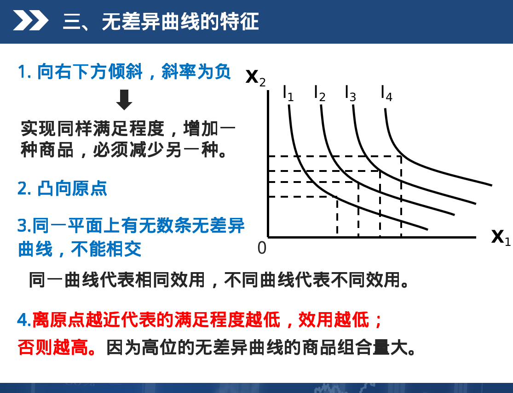

## 一、名词解释14个

### 边际效用递减规律
> 第几章的考点？

在一定时期内， 在其他物品和劳务的消费数量不变的前提下， 随着消费者对某种物品和劳务消费量的增加， 从某一各数量开始， 边际效用是递减的。

### 滞涨
> 第几章的考点？

滞涨表示经济停滞， 与通货膨胀相对。

### 需求价格弹性

> 第几章的考点？

在一定时期内， 一种商品的需求量的变动对商品价格变动的反应程度。

### 无差异曲线

> 第几章的考点？

是用来表述两种商品或两组商品的不同数量组合对消费者提供的效用是相同的曲线。

### 边际技术替代率

> 第几章的考点？

在维持产量不变的前提下， 增加一单位某生产要素的投入量所要减少的另一种生产要素的投入数量。

### 边际收益递减规律

> 第几章的考点？

在技术水平不变的前提下， 当连续将数量相等的某种生产要素增加到一种或几种数量不变的生产要素上时， 从某一数量开始， 边际产量递减。

### 消费者剩余

> 第几章的考点？

消费者在购买一定数量的商品时愿意支付的总价格与实际支付的总价格的差额。

### 洛伦兹曲线

> 第几章的考点？

反应社会收入平均程度的曲线。

### 恩格尔定律

> 第几章的考点？

随着收入的增加， 食品支出占总支出的比例会减少。

### 机会成本

> 第几章的考点？

是指生产者所放弃的使用相同生产要素在其他生产用途中所能够获得的最高收入。

### 内在稳定器

> 第几章的考点？

指经济系统本身存在一种减少各种干扰对国民收入冲击的机制， 能够在经济繁荣时自动抑制膨胀， 在经济衰退时自动减轻萧条， 无需政府采取任何行动。

### 经济增长

> 第几章的考点？

是指一国生产的商品和劳务总量的增加。

### 国内生产总值

> 第几章的考点？

是指一个国家或地区一年内所产生的全部最终产品和劳务的市场价格总和。

### 奥肯定律

> 第几章的考点？

失业率每高于自然失业率一个百分点， 实际GDP将低于潜在GDP两个百分点。

## 二、简答题

### 无差异曲线的形状特征
> 第几章的考点？

1. 向右下方倾斜，　斜率为负
  实现同样的满足程度，　增加一种商品，　必须减少另一种

２. 凸向原点

3. 同一平面上有无数的无差异曲线， 它们互不相交， 同一曲线代表相同的效用。

4. 离原点越近的曲线满足程度越低。

5. 如图
  

### 为什么人们购买债券和股票在经济学上不能称为投资。

> 第几章的考点？

经济学上的投资是指购买或置换资本品的支出。 而从全社会角度看，购买股票和债券仅仅在社会成员之间所有权的转移， 不是经济学意义上的投资。

### 结合一个现实中的例子简述边际效用递减规律

> 第几章的考点？

边际效用递减规律：
  在一定时期内， 消费者对其他物品和劳务的消费数量不变的前提下， 增加对某一物品和劳务的购买数量时， 在超过一定的数量后， 边际效用是递减的。

例子：
  吃一个面包很满足， 吃两个面包更满足， 但吃第十个面包， 只能是痛苦了。

### 简述需求量变动与需求变动的不同之处

> 第几章的考点？

“需求量变动”是在同一需求曲线上的变动， 而“需求变动”则是需求曲线的变动。

“需求量的变动”是指在其他条件不变的情况下， 商品本身价格变动所引起的需求量的变动。

“需求的变动”是指商品本身价格不变的情况下， 其他因素变动所引起的需求量的变动。

### 结合一个现实中的例子简述机会成本的概念

> 第几章的考点？

机会成本：
  生产者所放弃的使用同等生产要素投入在其他生产中所能够获得的最大收益。

例子：
  本来我工作一天能够与赚300块， 这是我一天的最大收益。而我今天没有工作， 我去游乐园玩了， 那么我去游乐园玩这间事情上， 我的机会成本就是300块。

### 简述等产量曲线及其特征

> 第几章的考点？

等产量曲线：
  表示能够产生出相等产量的两种生产要素投入量的全部组合。

特点：  
1. 向右下方倾斜，斜率为负。

2. 凸向原点

3. 同一平面上有无数条等产量曲线， 且等产量曲线之间互不相交。

4. 离远点越远的等产量曲线， 所代表的产量越大。

5. 如图

### 请运用总需求-总供给模型， 作图说明由于总需求受到意外的冲击引起的经济衰退。

> 第几章的考点？

### 简述垄断竞争市场的含义及其条件

垄断竞争市场：
  是一种既有垄断因素又有竞争因素， 既不完全垄断和又不是完全竞争的市场。

垄断竞争市场的条件：
  1. 最基本条件：同种产品之间存在差异。
  2. 存在较多的厂商
  3. 进出该生产集团比较容易。

有差别的同类产品：是产生垄断竞争的根源
  1. 有差别存在就会有垄断：
    同种产品之间在质量、包装、牌号、销售条件甚至服务质量上存在差异， 使每个厂商都享有一部分顾客的偏爱和信任， 影响到产品价格。
  2. 垄断竞争厂商是自己产品的垄断者。如果提高价格， 不会失掉所有顾客。
  3. 作为同种产品， 可以互相替代， 满足同样的需求。这种替代性就会引起产品之间的竞争。

### 货币政策的一般政策工具包括哪些？
1. 贴现率：中央银行给其他商业银行或其他金融机构的放贷利率。  
  贴现率上升， 则货币供给量M减少。属于紧缩政策  
  贴现率下降， 则货币供给量M增加。属于扩张性货币政策， 也成宽松的货币政策  

2. 公开市场业务（最常用）
  中央银行在公开市场上买卖政府债券。
  买政府债券， 货币供给量M减少
  买政府债券， 货币供给量M增加

3. 法定准备金率（最不常用）   
  法定准备金率增加， 货币供应量M减少。  
  法定准备金率减少， 货币供应量M增加。

### 去年生产的产品今年出售是否计入今年GDP？为什么？
  不计入， 因为GDP只统计当年生产的最终产品和劳务的市场价值。去年生产的虽然今年出售， 但作为存货已经计入去年的GDP了。

### 什么是成本推动的通货膨胀？请画图说明。

## 计算

### 均衡价格和均衡数量
Qd = Qs

### 利润最大化原则
  利润 = 总收益TR - 总成本TC
  总收益TR = PQ

### 消费者均衡

### 国民收入的相关指标的计算（含GDP）
假设某国某年发生了以下活动：（a）一金矿公司支付10万美元工资给工人开采了10公斤金， 卖给一金器制造商， 售价30万美元；（b）金器制造商支付25万工资给工人加工一批手镯卖给消费者， 售价100万美元。

1. 用最终产品生产法计算GDP
  最终产品是手镯， 价格一百万美元， 所以GDP = 100万美元

2. 每个生产阶段生产了多少价值？用增值法计算GDP。
  第一阶段生产价值30万美元
  第二阶段生产价值100-30 = 70万美元

3. 在生产活动中赚得的工资和利润各为多少？用收入法计算GDP
  工资 = 10 + 25 = 35万美元
  利润 = （30-10） + （70-25） = 65万美元
  用收入法计算GDP = 35+65 = 100万美元

### 短期七种成本的类型及计算
