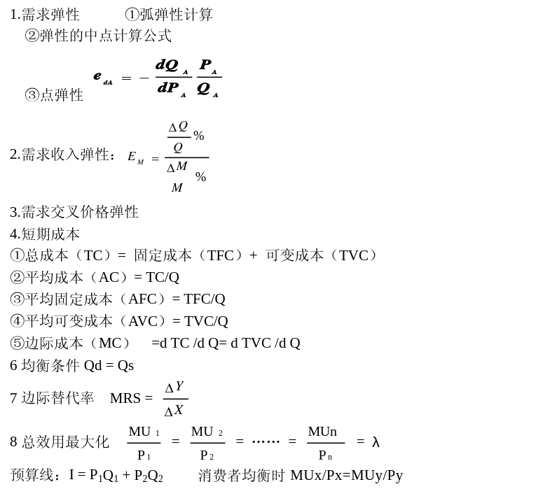
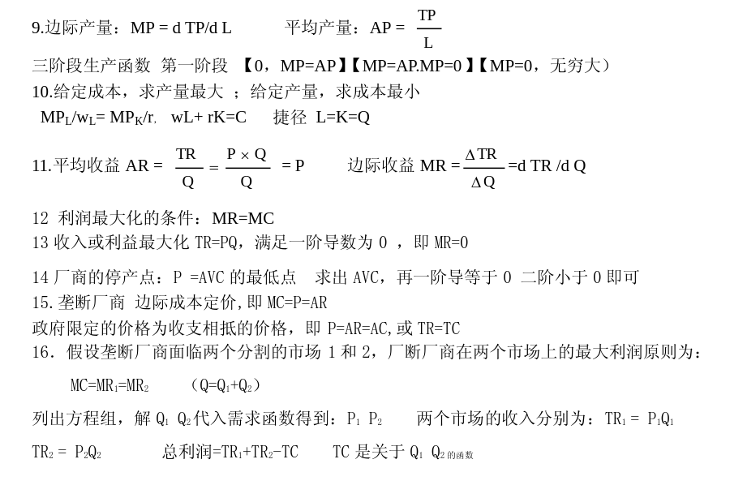
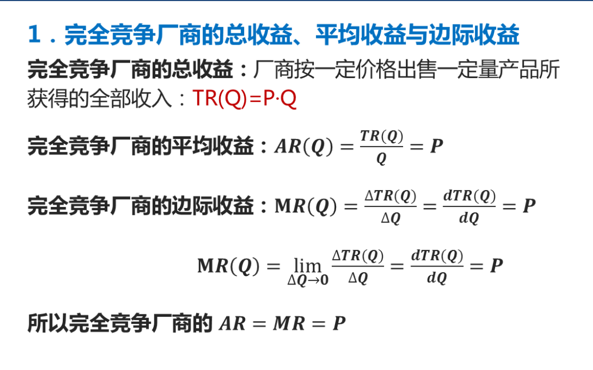
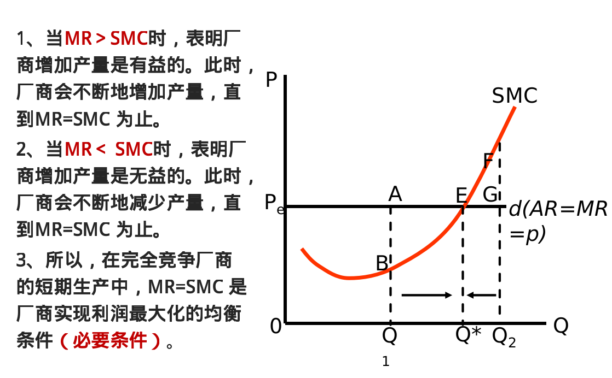
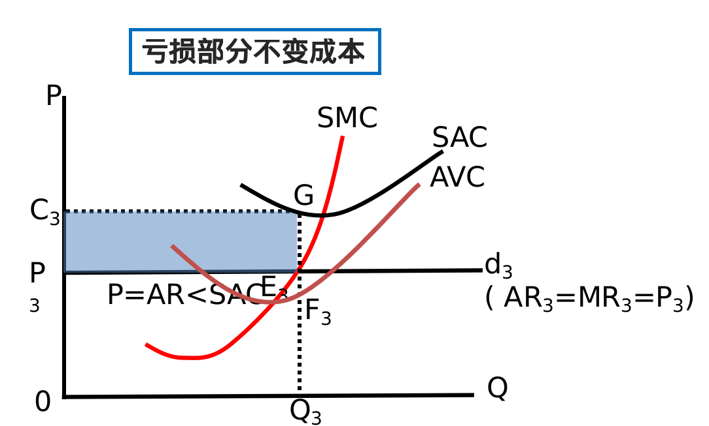
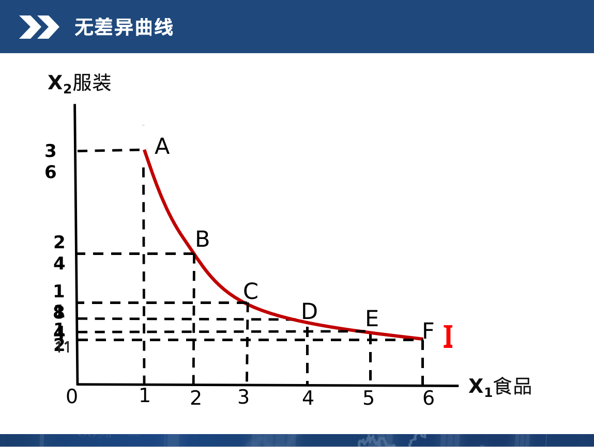
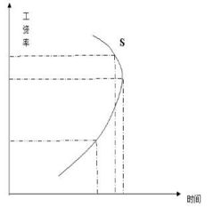
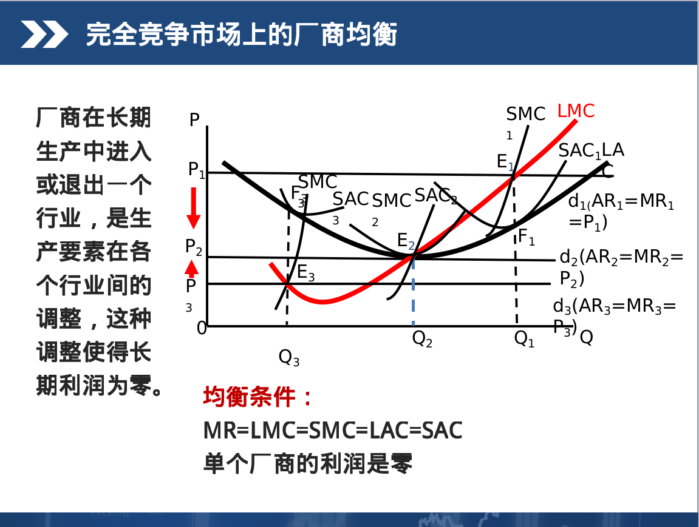

# Economics-notes
> 经济学复习笔记,出自模拟题

### 名词解释
- 经济稀缺性：人力资源和非人力资源的数量都是有限的
- 边际效用递减规律：在一定时间内，在其它商品的消费数量保持不变的条件下，随着消费者对某种商品消费量的增加，从某一数量开始，消费者从该商品中梁旭增加的每一消费单位所得到的效用(边际效用)都是递减的
- 机会成本：指的是生产者所放弃的使用相同的生产要素在其他生产用途中所能得到的最高收入
- 劳动的边际生产力：是指在技术水平和其他生产要素投入不变的情况下，增加一单位的劳动投入所增加的常量
- 市场：是物品买卖双方相互作用并地以决定其交易价格和交易数量的一种组织形式和制度安排
- 需求：指消费者在一定时期内在各种可能的价格下，对某种商品愿意而且能够购买的数量
-
- 边际效用：指的是消费者在一定时期内增加一单位商品的消费所得到的效用量增量
- 交易成本：任何交易都可以看成是交易双方所达成的一项契约，围绕契约所产生的成本，都称为交易成本
- 寡头市场：指的是少数几家长厂商控制整个市场的产品和销售的这样一种市场组织
- 洛伦兹曲线：用来衡量社会收入分配（或财产分配）平均程度的曲线．弯曲程度越大，收入分配程度越不平等
-
- 机会成本：是指为了得到某种东西而要放弃另一些东西的最大价值
- 生产函数：在一定时期内，在技术水平不变的情况下，生产中所使用的各种生产要素的数量与能生产的最大产量之间的关系
- 边际技术替代率：指的是在产量保持不变的前提下，增加一单位某种生产要素可以代替的另外一种要素的数量
- 资源配置：相对稀缺资源在各种不同用途上加以比较做出的选择
- 效用：消费者通过消费等使得自己的需求得到一个满足的度量
- 供给：是指一定时期内，厂商在各种可能的价格下，对某种产品愿意并能够提供的数量
- 边际报酬递减规律：在技术水平和其它生产要素投入不变的情况下，连续增加某种生产要素投入量，从某一点以后，所得到的边际报酬是递减的
- 资本的边际生产力：指的是在技术水平和其他生产要素与投入不变的条件下，增加一单位资本所增加的产出
- 生产者剩余：是指厂商在提供一定数量的某种商品是实际接收的总支付和愿意接收的最小总支付直接的差额
- 垄断市场：是指整个行业中只有唯一的一个厂商的市场组织
-
- 需求定律：在一定时期内，在其它条件不变的情况下，一种商品的需求量与其本身的价格成反方向变动
- 消费者剩余：是指消费者在购买一定数量的某种产品是愿意支付的最高总价格与实际支付的总价格之间的差额
- 收入效应：是由商品的价格变动所引起的实际收入水平变动，进而由实际收入水平变动所引起的商品需求量的变动
- 机会成本：指生产者所放弃的使用相同的生产要素在其它生产要素中所能得到的最高收入
- 寡头市场：指的是少数几家长厂商控制整个市场的产品和销售的这样一种市场组织
-
- 供给定律：在一定时期内，在其它条件不变的情况下，一种商品的供给量与商品本身的价格成同方向移动
- 边际报酬：在短期内，在一定技术条件下，其他生产要素投入不变，每增加一单位生产要素的投入，相应增加的产出量
- 替代效应：由商品的价格变动所引起的商品相对价格的变动，进而由商品的相对价格变动所引起的商品需求量的变动（补充：相对价格是两种或多种商品之间的价格对比关系）
- 交易成本：任何交易都可以看成是交易双方所达成的一项契约，围绕交易交易契约所产生的成本
- 垄断市场：指整个行业中只有唯一的一个厂商的市场组织
-
- 外生变量：
- 不确定性
- 需求函数
- 寡头市场
- 正常利润
---

### 判断题
- 微观经济学是经济学的一个分支，它主要研究个体行为(对).
- 互补价格上升一般会导致需求曲线向右移动(错)
- 如果一个企业降低其商品价格，发现收入下降，这认为这该商品的需求富有价格弹性(错)
- 在寡头市场结构中，该行业只有少数几个企业，但是没有一个企业要达到要考虑其它竞争对手的行为(错)
- 因为土地的＂自然供给＂是固定不变的，所以土地的供给曲线是垂直的.(对)
-
- 市场不能解决每种商品生产多少的问题（错）
- 在均衡价格下，价格没理由会变动（对）
- 如果一种商品的需求价格弹性是0.5， 价格由一美元上升到1.04美元会导致需求量下降2%（对）
- 在竞争市场上， 倘若企业面临边际成本大于边际收益的局面， 则企业减少产量， 利润会减少。（错）
- 工资率的上升会有收入效应和替代效应， 两者的作用方向相反， 如果工资率一直增长到使替代效应起主要作用，则导致劳动供给曲线向后弯曲。（错）**？**
-
- 规范经济学主要研究＂是什么＂（错）　　
- 一种活动的机会成本是为这种活动所花费时间的价值（错）
- 政府给定的价格使得商品的需求量大于供给量，则该价格为支持价格（错）
- 一个行业有许多企业，每个企业销售的产品与其他企业的略有差别，这样的市场结构被称为垄断市场（对）
- 完全竞争厂商使用要素的原则是要素价格等于边际产品价值（对）？
-
- 经济学分析的基本问题是因为资源稀缺而必须作出的选择（对）
- 市场供给线是每个价格水平上将个体企业的供给曲线垂直叠加得出（错）
- 当市场达到竞争模型所描述的状态，经济是有效率的，这意味这资源没有被浪费（对）
- 追求利润的最大化的企业把产量定在总收益超过总成本的量的最大的地方（对）
- 准租金就是对供给量固定的生产要素的支付（错）
-
- 市场体制配置资源是通过价格进行的（对）
- 替代品价格上升一般会导致需求曲线向右移动（对）
- 在完全竞争市场中，企业是价格的接受者（对）
- 对于一个垄断企业而言，销售额外一单元产品的边际收益等于，这额外一单位产品的售价减去支付给生产这一单元产品的工人的工资（错）
- 基尼系数比洛伦兹曲线更能反映收入分配不平等程度（错）
-
- 引起垄断竞争的基本条件是产品无差别（错）
- 体育明星的收入有一部分属于经济租金（对）
- 正常利润是对风险的报酬（错）
- 假定其他条件不变，某商品价格的下降将引起需求的增加和供给的减少（对）
- 对某个厂商的商品的需求曲线一定是向右下方倾斜的（错）
---
### 选择题
- 短期内，那种生产要素可变？**（C）劳动**
- 根据需求定理，下列哪一个因素是影响需求的最主要因素？**（A）价格**
- 下列哪种商品不满足需求定理？**（D）耐用品**
- 在同一条无差异曲线上的不同点表示 **（B）效用水平相同，但消费的两种商品组合比例不同**
- 微观经济学中，所提的＂资源的稀缺性＂是指 **（C）相对于需求，资源总是不足的**
- 长期平均成本曲线实际上是由无数条 **（A：短期平均成本）** 曲线的包络线
- 短期中的边际成本曲线MC是一条U型曲线，随着产量的增长先逐渐下降，达到最低点之后又逐渐上升，相继穿过 **（D）AVC曲线和AC曲线的最低点**
- 两种商品的交叉弹性小于零，说明两种商品的关系是 **（B）互补品**
- 边际成本低于平均成本，则有 **（C）平均成本下降**
- 如果某一商品价格下跌10%导致需求量增加了2%,则需求曲线这一部分的需求价格弹性为 **(A)缺乏弹性**
- 某一商品的需求曲线越陡峭，表明该商品的需求价格弹性 **(B)越小**
- 下列哪一项不属于消费者均衡条件？**（C）各种商品的边际效用相等**
- 总效用曲线达到最高点时，则有 **（C）边际效用等于零**
- 航空公司经常通过打折来促销机票，其原因是其 **（A）边际收益大于边际成本**
- 等成本线向外平移，表明 **（D）所有商品的价格都下降了**
- 在完全竞争市场上，厂商短期均衡条件是 **（D）P=MC**
- 政府把火车票价格限制在均衡价格以下，会导致 **（C）买火车票容易**
- 经济学划分长期和短期，基于 **（B）可否调整生产规模**
- 下列哪个行业最接近完全竞争状态 **（C）农业**
- 房地产开发商品开发楼盘是，出现了资金链断裂，新楼无法投入使用而变成的烂尾楼，开发商的主要成本是 **（A）沉没成本**
---

### 填空题
- 西方经济学的鼻祖是<u>**亚当＊斯密**</u>
- 微观经济学的研究对象是<u>个体经济单位</u>
- 实行最低限价会导致市场上出现<u>**产品过剩**</u>的情况
- 投入产出生产函数的规模报酬是<u>**不变**</u>的
- 生产者也称厂商或企业，它是能够做出统一的<u>**生产决策**</u>的单个经济单位
- 完全竞争厂商的需求曲线是一条<u>**由既定市场价格水平出发的水平线**</u>
- <u>**正常利润**</u>是指厂商对自己所提供的企业家才能的报酬支付
- <u>**短期**</u>指生产者来不及调整全部生产要素的数量，至少有一种生产要素的数量是固定不变的时间周期
- 以不同价格销售同一产品，被称为<u>**价格歧视**</u>
- 基尼系数的取值范围是<u>**［0, 1］**</u>
-
- <u>**经济稀缺性**</u>是指经济生活中这样一个基本事实，人力资源和非人力资源的数量都是有限的
- 在微观经济学中，一般总是假定厂商的目标是<u>**追求利润最大化**</u>
- 最高限价下的供不应求会导致市场上消费者的排队抢购和<u>**黑市交易盛行**</u>
- 在农业生产活动中， 存在着这么一种经济现象：在丰收的年份，农民的收入非但没有增加反而减少了，这种现象在我国被称之为<u>**谷贱伤农**</u>
- 效用理论有两种， 一种是基数效用理论，另一种是<u>**序数效用论**</u>
- 土地的生产要素一般被划分为劳动、土地、资本和<u>**企业家才能**</u>这四种类型
- <u>**固定成本**</u>是指厂商在短期之内必须支付的不能调整的生产要素的费用
- 厂商实现利润最大化的均衡条件是<u>**边际收益大于边际成本**</u>
- 厂商主要可以采取三种组织形式：个人企业， 合伙制企业， <u>**公司制企业**</u>。
- 不完全竞争市场分为三种类型：它们是<u>**垄断竞争市场**</u>、寡头市场、垄断市场
-
- 对经济现象进行分析通常采用两种不同的方法：一种是确定经济变量之间的数量关系，即<u>**实证分析**</u>；
另一种是从个人价值出发，对经济现象进行评价，即<u>**规范分析**</u>
- 经济学从分析层面，可以分为<u>**微观经济学**</u>和<u>**宏观经济学**</u>
- 用一种商品去替代另一种商品的比率，叫做<u>**边际替代率**</u>
- 生产中投入了两种重要的要素，一种是<u>**劳动**</u>，　另一种是<u>**资本**</u>
- 已经花费出去而无法补偿的成本，称之为<u>**沉没成本**</u>
- 当厂商的利润达到最大化时，其必要条件是<u>**边际收益等于边际成本**</u>
- 认为主观感受能够计量和加总的理论，叫做<u>**基数效用论**</u>
-
- 经济学研究的三个基本问题：生产什么物品和生产什么，如何生产物品<u>**为谁生产物品**</u>
- 影响商品供给量的最主要因素是<u>**商品本身的价格**</u>
- 一种商品的<u>**均衡价格**</u>是指该商品的需求量与市场供给量相等时的价格
- 最高限价下的供不应求会导致市场上消费者的排队抢购和<u>**黑市交易盛行**</u>
- 影响经济增长的因素有三种：劳动，资本和<u>**技术进步**</u>
- 在边际报酬递减规律作用下的边际成本MC曲线表现出先降后升的<u>**U型特质**</u>
- 在柯布－－道格拉生产函数中，如果a+b>1,则规模报酬<u>**递增**</u>
- <u>**长期**</u>指生产者可以调整全部生产要素的数量的时间周期
- <u>**行业**</u>指为同一个商品市场生产和提供商品的所有厂商的总体
- 克拉克认为，工资取决于<u>**劳动的边际生产力**</u>
-
- 现代的经济制度，一般分为以下三种类型，市场经济制度，计划经济制度，<u>**混合经济制度**</u>
- 当一种商品的价格发生变化时，会对消费者产生两种影响：一是使消费者的实际收入水平发生变化，二是使商品的相对价格发生变化。这两种变化都会改变消费者对该种商品的需求量。前者称为<u>**收入效应**</u>，后者称为替代效应
- 微观经济学的研究对象是<u>**个体经单位**</u>
- 实行最低限价会导致市场上出现<u>**产品过剩**</u>的情况
- 在丰收的年份，农民的收入却反而减少了，这种现象在我国民间被形象地概括为“<u>**谷贱伤农**</u>”
- 效用理论有两种，一种是基数效用理论，另一种是<u>**序数效用论**</u>
- 厂商实现利润最大化的均衡条件是<u>**边际收益等于边际成本**</u>
- 投入产出生产函数比较适合于反映<u>**中间**</u>投入（原材料，燃料等投入）与产出之间的关系
- <u>**无差异曲线**</u>是用来表示能够给消费者带来相同的效用水平或者满足程度的两种商品的组合
- <u>**卖方垄断厂商**</u>厂商是指：厂商在产品市场上（作为产品的卖方）是垄断者，但在要素的市场上（生产要素的买方）是完全竞争者
-
- 根据市场结构特征，市场可以分为　<u>**完全竞争**</u>，<u>**垄断竞争**</u>，<u>**寡头**</u>　和垄断市场四种类型
- 供给量随着价格的上升而　<u>**增加**</u>，或随着价格的下降而　<u>**减少**</u>
- 生产要素的价格越高，居民愿意提供的生产要素的数量就　<u>**多**</u>，所以生产要素的供给曲线向　<u>**右上方**</u>　倾斜
- 生产要素包括　<u>**土地**</u>，　<u>**劳动**</u>，　<u>**企业家才能**</u>　和资本
---
### 计算题

---
### 简答题
- 决定市场类型划分的主要因素
> 答: 市场上厂商的数组，厂商所生产的产品的差别程度，单个厂商对市场价格的控制程度，
厂商进入或退出一个行业的难易程度

- 为什么说＂平均成本曲线AC和边际成本曲线MC交于AC的最低点＂作图说明

> - 在交点的左边，MC<AC，每增加一单位产量，可使得平均成本减少;
> - 在交点的右边，MC>AC，每增加一单位产量，可使得平均成本增加.所以交于最低点

- 柯布－道格拉斯函数的规模报酬
> - PPT上貌似没有这个函数
> - 
- 为什么完全竞争厂商的短期供给曲线是SMC曲线上等于和高于AVC曲线最低点部分
> - 短期边际成本(short run marginal cost, **SMC**)是指在短期内，厂商每增加一单位产量所引起的总成本的增加量。
> - 平均可变成本**AVC**：是厂商在短期内平均每生产一单位产品所消耗的可变成本。AVC（Q）=TVC（Q）/Q（补充：**可变成本**（Variable Costs）又称变动成本，是指在总成本中随产量的变化而变动的成本项目）
> - MR是边际收益，AR是平均收益，在完全竞争厂商中，AR=MR=p，解释如下图
> - 
> - MR与SMC的关系
> - 
> - 题解：对于完全竞争厂商来说，有P=MR, 所以完全竞争厂商的短期均衡条件又可以写为P=MC(Q)，　此式可以理解为：在给定一个价格水平P,完全竞争厂商应该选择最优的生产量Q, 使得P=MC(Q)成立，从而实现最大的利润（图中SMC与MR的交点E对应的Q）,这意味着存在价格P和厂商的最优产量Q.而厂商的SMC曲线恰好准确地表面了这种商品的价格和厂商的短期供应量之间的关系
> - 答案说的不清楚，我再补充一点，上图
> - 
> - SMC曲线与AVC曲线一定相交于AVC曲线的最低点（点E），在相交之前，平均可变成本一直在减少，边际成本小于平均可变成本；在相交之后，平均可变成本一直在增加，边际成本大于平均可变成本。在交点E，平均可变成本达到最低，边际成本等于平均可变成本。西方经济学家称**AVC与SMC的交点E为停止营业点**，即产品售价低于此点时，厂商如果进行生产，连可变成本也无法补偿，因此决不会再生产。
- 请简要说明边际效用递减规律产生的原因？
> - 在一定时期内，在其他商品的消费数量保持不变的条件下，随着消费者对某种商品消费量的增加，消费者从该商品连续增加的每一消费单元中所得到的效用增量即边际效用是递减的
> - 原因有二：第一是生理或心理的原因，第二是物体本身用途的多样性
- 请简述等产量线与无差异曲线的异同
> - 无差异曲线：表示两种商品或两组商品的不同数量的组合对消费者所提供的效用是相同的
> - 等生产曲线：表示能生产出相同产量的两种要素的投入量的全部组合方式的曲线
> - 
> - 相同点：无差异曲线和等常量曲线都是右下方倾斜的曲线，两者都是凸向远点的曲线
> - 不同点：无差异曲线是表示相同效用，等生产曲线是表示相同产量下的各种组合
- 影响商品供给量的主要因素
> - 商品价格，生产成本，生产的技术水平，相关商品的价格，生产者对未来的预期
- 为什么说＂生产要素的需求是一种派生的需求＂
> - 企业要通过生产要素去生产产品
> - 生产要素本身并不能满足消费者的任何需求，而借助生产要素生产出来的产品与劳务才是消费者所要购买的对象
> - 因此，正是消费者对产品与劳务的需求派生了企业对生产要素的需求，所以说，生产要素的需求是一种派生的需求
- 为什么说＂边际收益曲线MR与平均收益曲线AR交于AR的最大值点处＂
> - 在交点左边，MR>AR，增加一单位的产量，使得AR增大
> - 在交点右边，MR<AR，怎家一单位的产量，使得AR变下
> - 由此可见交于最高点
- 个人劳动供给曲线为什么向后弯曲
> - 
> - 当工资较低时，随着工资的上升，消费者为较高的工资吸引而减少闲暇，增加劳动供给量，这个阶段，劳动供给量向曲线右上方倾斜
> - 当工资涨到某一时刻，消费者的劳动供给量达到最大，这个时候，如果继续增加工资，劳动供给量反而会减少，于是，劳动供给曲线开始向后弯曲
---
- 价格机制如何在市场均衡中发挥作用的？
> - 当供大于求，生产者之间的竞争会导致价格下降
> - 当供小于求，消费者之间的竞争会导致价格上涨
> - 当供等于求，双方处于相对平衡的状态，此时的价格是均衡价格
> - 如果出现外力的干预（垄断力量或者国家），那么这就不是均衡价格了
- 为什么有些物品（如化妆品）可以薄利多销，而有些物品（如药品）却不行？是不是所有的药品都不能薄利多销，为什么？
> - 弹性与总收益的关系：
> - 需求富有弹性的商品，价格与总收益总是成反方向变动（即价格上升，总收益下降，价格下降，总收益上升）
> - 需求缺乏弹性的商品，价格与总收益是同方向变动（价格上升，总收益上升）
> - 所以，需求富有弹性的商品可以薄利多销，需求缺乏弹性的则不行
### 分析题
- 分析谷贱伤农的现象和原因
> - 在丰收的年份，农民的收入非但没有增加反而减少了，这种现象称为＂谷贱伤农＂.　
> - 原因:粮食是生活的必须品，缺乏弹性，在丰收的年份，粮食价格很低，尽管需求量有所增加，但没有价格下降的幅度大，从而导致农民的收入反而减少

- 规模报酬和边际报酬的区别
> - 规模报酬与边际报酬都存在递增，不变和递减三个阶段
> - 规模报酬是在长期分析中，所有投入要素都按同一比例变动，由于规模经济和规模不经济引起的
> - 边际报酬是在短期分析中，只变动一种投入而其他投入不变，由于变动投入与固定投入的比例发生变动而产生的

- 恩格尔定律及其原因
> - 定义：在一个家庭或者在一个国家中，食物支出在收入中所占的比例随着收入的增加而减少，用弹性概念来描述：对于一个家庭或者国家来说，富裕程度越高，则食物支出的收入弹性越少，反之，越大．
> - 解释：当收入增加是，食品的支出也在增加，但由于食品的必需品，所以增加的幅度小于收入增加的幅度，所以二者的比例会下降，即恩格尔系数呈下降的趋势．
- 为什么完全竞争厂商的需求曲线是一条水平线?
> - 在完全竞争市场中，每一个厂商都有对自己产品的需求曲线
> - 由于厂商数目很多，并且彼此间产品的同质的，所以每个厂商的产量并不影响行业的供给曲线
> - 因为厂商是既定价格的接受者，所以在价格－数量图中，厂商的需求曲线是一条水平线，因为市场上的价格不会随着厂商自己的需求变动而变动，所以不论该厂商提供多少产量，其销售价格都不会发生变动，所以在完全竞争市场上，厂商的需求曲线是一条平行线．
- 影响我国房地产市场需求的因素有哪些
> - 房地产价格，购房者的收入，人口数量，城镇化进程等等
- 影响我国房地产市场供给因素有那些
> - 房地产价格，土地的价格及政策，财政政策，信贷政策等等
- 房地产市场的供给与需求如何影响房价
> - 房地产供给增加，需求不变，房价下降
> - 房地产供给不变，需求增加，房价上涨
> - 房地产供给增加幅度大于需求增加幅度，房价下跌
> - 房地产供给增加幅度小于需求增加幅度，房价上涨
- 论述管制价格的不良后果
> - 价格管制是指政府对市场上的商品或服务对价格进行控制
> - 管制价格的不良影响：资源使用不当，产品分配不公，产品质量变异，黑市交易盛行
> - 管制价格是政府为贯彻执行国家经济政策而不得不才去的一种权宜之计，由于是人为限定，所以往往会带来一些不良影响
- 一般认为，竞争市场是有效率的，但为什么有时会出现市场失灵？解决市场失灵的方法有那些？既然市场会出现失灵，为什么我们还要建立市场经济体质？
> - 市场经济是高效率的经济，也是可以实现资源合理分配的经济
> - 市场经济也有失灵的时候，如收入分配不公，外部不经营等失衡
> - 市场有其高效分配资源的一面，也有自身无法解决的缺陷，这就需要政府的干预和调节
> - 市场不是万能的，也没有一个组织或机构是万能的，政府也有失灵的情况，但总不能因为有失灵的概率就去否定它
> - 市场能高效地实现有限资源的合理分配，为了充分发挥和运用市场的这个长处，因此我国要建立市场经济体制
- 为什么说完全竞争的市场经济符合帕累托最优状态
> - 帕累托最优是是指资源分配的一种理想状态
> - 在完全竞争市场的长期均衡状态下，厂商的平均成本，边际成本和边际收益都是相等的，等于市场价格，这意味着完全竞争市场是最有效率的.
> - 边际成本等于市场价格，意味着最后一单位的产量消耗的资源的价值恰好等于该单位产量的社会价值，此时产量达到最优，如果边际成本大于市场价格，最后一单位的产品则不值这么多
> - 平均成本等于市场价格，意味着生产者提供该数量的产品所获得的收益加好补偿了企业的生产费用，从而企业没有超额的利润，消费者没有支付多余的费用，买卖双方都是公平的

- 试论述供给的变动与供给量变动的区别
> - 供给量变动：是指在其他条件不变时，由商品自身的价格变动所引起的该商品供给数量的变动（价格因素），是同一条供给曲线上的变动
> - 供给变动：是在价格不变的条件下，由于其它因素引起的该商品供给数量的变动（非价格因素），供给曲线左右移动
- 试论述完全竞争条件下生产要素价格的均衡
> - 
> - **分析题在第五章有比较多的考点**
> - 在完全竞争条件下，厂商对生产要素的需求是按照边际产品的价值与要素的边际成本相等，即根据价格来觉得需求量的，也就是VMP=P\*MP=W.要素L的需求函数反映的是在其它条件不变时，完全竞争厂商对要素L的需求量与要素价格W之间的关系，随着要素价格的上升，厂商对要素的最佳使用量即需求量下降，由于 P\*MP=W,因此，在P\*MP，在完全竞争条件下，厂商对单一要素的需求曲线将与边际产品价值曲线完全重合
> - 在要素完全竞争市场上，要素的供给曲线是一条向右上方倾斜的曲线，要素的供给曲线是一条向右上方倾斜的曲线，要素的供给曲线与需求曲线相交之点就是均衡点，此时对应的要素价格就是均衡价格．
