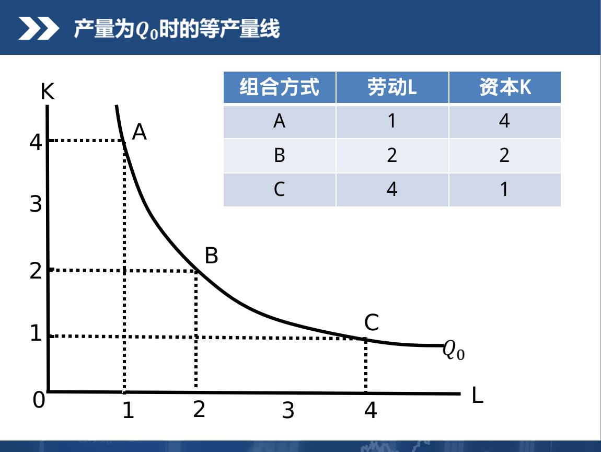
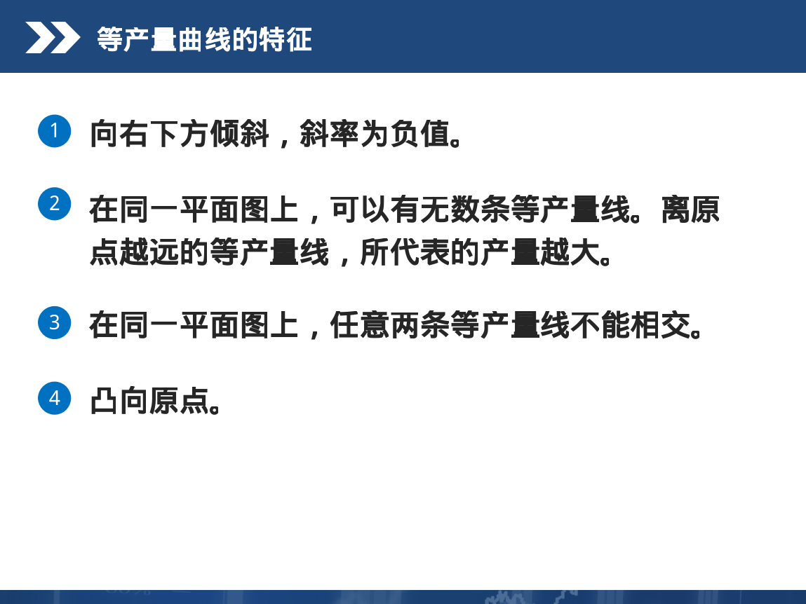
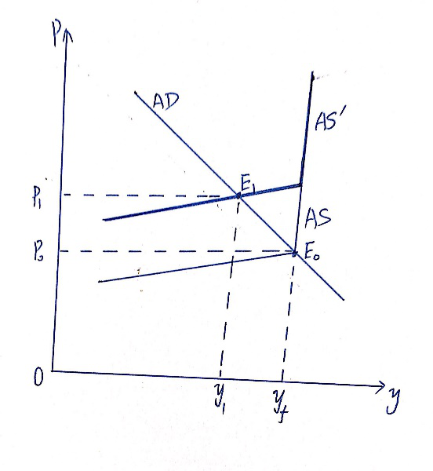
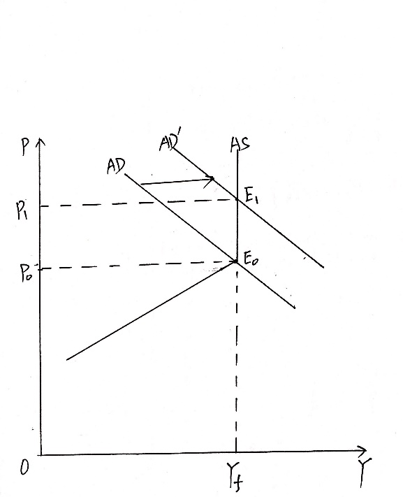

经济学复习
------

目录
----

-   [总复习](#总复习)
-   [目录](#目录)
-   [一、名词解释14个](#一名词解释14个)
    -   [边际效用递减规律：](#边际效用递减规律)
    -   [滞胀：](#滞胀)
    -   [需求价格弹性：](#需求价格弹性)
    -   [无差异曲线：](#无差异曲线)
    -   [边际技术替代率：](#边际技术替代率)
    -   [边际收益递减规律：](#边际收益递减规律)
    -   [消费者剩余：](#消费者剩余)
    -   [洛伦兹曲线：](#洛伦兹曲线)
    -   [恩格尔定律：](#恩格尔定律)
    -   [机会成本：](#机会成本)
    -   [[内在稳定器](http://baike.baidu.com/view/436740.htm)：](#内在稳定器)
    -   [经济增长：](#经济增长)
    -   [国内生产总值：](#国内生产总值)
    -   [奥肯定律：](#奥肯定律)
-   [二、简答11个](#二简答11个)
    -   [无差异曲线的形状特征](#无差异曲线的形状特征)
    -   [为什么人们购买债券和股票在经济学上不能称为投资？](#为什么人们购买债券和股票在经济学上不能称为投资)
    -   [结合一个现实中的例子简述边际效用递减规律。](#结合一个现实中的例子简述边际效用递减规律)
    -   [简述需求量变动与需求变动的不同之处。](#简述需求量变动与需求变动的不同之处)
    -   [结合一个现实中的例子简述机会成本的概念。](#结合一个现实中的例子简述机会成本的概念)
    -   [简述等产量曲线及其特征。](#简述等产量曲线及其特征)
    -   [请运用总需求-总供给模型，作图说明由于总需求受到意外的冲击引起的经济衰退。\*\*](#请运用总需求-总供给模型作图说明由于总需求受到意外的冲击引起的经济衰退)
    -   [简述垄断竞争市场的含义及其条件。](#简述垄断竞争市场的含义及其条件)
    -   [货币政策的一般政策工具包括哪些？](#货币政策的一般政策工具包括哪些)
    -   [去年生产的产品今年出售是否计入今年的GDP？为什么？](#去年生产的产品今年出售是否计入今年的gdp为什么)
    -   [什么是成本推动的通货膨胀？请画图说明。](#什么是成本推动的通货膨胀请画图说明)
-   [计算5个](#计算5个)
    -   [均衡价格和均衡数量。](#均衡价格和均衡数量)
    -   [利润最大化原则。](#利润最大化原则)
    -   [消费者均衡。](#消费者均衡)
    -   [国民收入的相关指标的计算（含GDP）。](#国民收入的相关指标的计算含gdp)
    -   [短期七种成本的类型及计算。](#短期七种成本的类型及计算)
-   [论述（完全）4个](#论述完全4个)
    -   [均衡价格理论及其应用。](#均衡价格理论及其应用)
    -   [宏观经济政策的目标及相互制约关系。](#宏观经济政策的目标及相互制约关系)
    -   [用总需求-总供给曲线图解释成本推动的通货膨胀。](#用总需求-总供给曲线图解释成本推动的通货膨胀)
    -   [用总需求-总供给曲线图解释需求拉上的通货膨胀。](#用总需求-总供给曲线图解释需求拉上的通货膨胀)

一、名词解释14个
----------------

### 边际效用递减规律：

在一定时期内，在其他物品和劳务的消费数量保持不变的条件下，随着消费者对某种物品和劳务消费量的增加，从某一个数量开始，边际效用是递减的。

### 滞胀：

经济停\_滞\_与通货膨\_胀\_并存的经济现象。

### 需求价格弹性：

在一定时期内一种商品的需求量的变动对价格变动的反应程度。

### 无差异曲线：

是用来表示两种商品或两组商品的不同数量的组合对消费者所提供的效用是相同的曲线。

### 边际技术替代率：

在维持产量水平不变的条件下，增加一单位某种生产要素的投入量时所减少的另一种要素的投入数量。

### 边际收益递减规律：

在技术水平不变的情况下，当连续把数量相等的某种生产要素增加到一种或几种数量不变的生产要素上时，从某一数量开始，边际产量递减。

### 消费者剩余：

消费者在购买一定数量的某种商品时愿意支付的最高总价格和实际支付的总价格之间的差额。

### 洛伦兹曲线：

用来反映社会收入分配（或财产分配）平均程度的曲线。

### 恩格尔定律：

随着收入的增加，食品支出在总支出中所占比重（恩格尔系数）递减。

### 机会成本：

是指生产者所放弃的使用相同的生产要素在其他生产用途中所能得到的最高收入。

### [内在稳定器](http://baike.baidu.com/view/436740.htm)：

指经济系统本身存在的一种减少各种干扰对[国民收入](http://baike.baidu.com/view/18600.htm)冲击的机制，能够在经济繁荣时期自动抑制膨胀，在[经济衰退](http://baike.baidu.com/view/822530.htm)时期自动减轻萧条，无须政府采取任何行动。

### 经济增长：

是指一国生产的商品和劳务总量的增加。

### 国内生产总值：

是指一个国家或地区一年内所生产的全部最终产品和劳务的市场价值总和。

### 奥肯定律：

失业率每高于自然失业率1个百分点，实际GDP将低于潜在GDP2个百分点。

二、简答11个
------------

### 无差异曲线的形状特征

> - 

### 为什么人们购买债券和股票在经济学上不能称为投资？

经济学上的投资是指购买或置换资本品（厂房、机器设备）的支出。从全社会角度看，人们购买债券和股票仅仅是在社会成员之间所有权的转移，不是经济学意义上的投资。

### 结合一个现实中的例子简述边际效用递减规律。

先讲什么是边际效用递减规律，再举例。

### 简述需求量变动与需求变动的不同之处。

"需求量的变动"是指在其他条件不变的情况下，商品本身价格变动所引起的需求量的变动。

是在同一条需求曲线上移动。

"需求的变动"是指商品本身价格不变的情况下，其他因素变动所引起的需求量的变动。

需求曲线向左（需求减少）或向右（需求增加）移动。

### 结合一个现实中的例子简述机会成本的概念。

先讲什么是机会成本，再举例。课件中讲过例子。

### 简述等产量曲线及其特征。

- 等产量曲线:表示能生产出相等产量的两种要素投入量的全部组合方式的曲线
> - 
> - 

### 请运用总需求-总供给模型，作图说明由于总需求受到意外的冲击引起的经济衰退。\*\*

### 简述垄断竞争市场的含义及其条件。

- 完全垄断:整个行业的市场完全处于一家厂商所控制的状态
> - 一家厂商控制了某种商品的全部资源或资本资源的供给,是价格的制定者
> - 独家厂商所用于生产某种商品的专利权
> - 政府特许,其它厂商不能进入该产品市场
> - 自然垄断,规模经济派生自然垄断

### 货币政策的一般政策工具包括哪些？

三个

（1）贴现率：中央银行给商业银行或其他金融机构的放贷利率。

贴现率↑ ，则货币供给量M减少。属于紧缩性政策

贴现率↓ ，则货币供给量M增加。属于扩张性货币政策，也称宽松的货币政策。

（2）公开市场业务（最常用）

中央银行在公开市场上买卖政府债券。

买政府债券，则货币供给量M增加。

卖政府债券，则货币供给量M减少

（3）法定准备金率（最不常用）

法定准备金率↑ ，则货币供给量M减少。

法定准备金率↓ ，则货币供给量M增加。

### 去年生产的产品今年出售是否计入今年的GDP？为什么？

不计入，因为GDP只统计当年生产的最终产品和劳务的市场价值。去年生产的虽然今年出售，作为存货已计入去年的GDP了。

### 什么是成本推动的通货膨胀？请画图说明。

计算5个
-------

### 均衡价格和均衡数量。

市场均衡条件：Qd=Qs

### 利润最大化原则。

利润∏=总收益TR-总成本TC

总收益TR=PQ

利润∏最大要求∏\'=0，由此求得Q等。

### 消费者均衡。

### 国民收入的相关指标的计算（含GDP）。

假设某国某年发生了以下活动：（a）一金矿公司支付10万美元工资给工人开采了10公斤金，卖给一金器制造商，售价30万美元；（b）金器制造商支付25万元工资给工人加工一批手镯卖给消费者，售价100万元。

（1）用最终产品生产法计算GDP

最终产品是手镯，价值100万美元，所以GDP=100万美元

（2）每个生产阶段生产了多少价值？用增值法计算GDP。

第一阶段生产价值30万美元

第二阶段生产价值100-30=70万美元

用增值法计算GDP=30+70=100万美元

（3）在生产活动中赚得的工资和利润各为多少？用收入法计算GDP。

工资=10+25=35万美元

利润=（30-10）+（70-25）=65万美元

用收入法计算GDP=35+65=100万美元

### 短期七种成本的类型及计算。

论述（完全）4个
---------------

### 均衡价格理论及其应用。

支持价格和限制价格的使用（概念、画图、分析）

### 宏观经济政策的目标及相互制约关系。

宏观经济政策的目标有四个：充分就业、物价稳定、经济持续增长、国际收支平衡

### 用总需求-总供给曲线图解释成本推动的通货膨胀。

### 用总需求-总供给曲线图解释需求拉上的通货膨胀。

