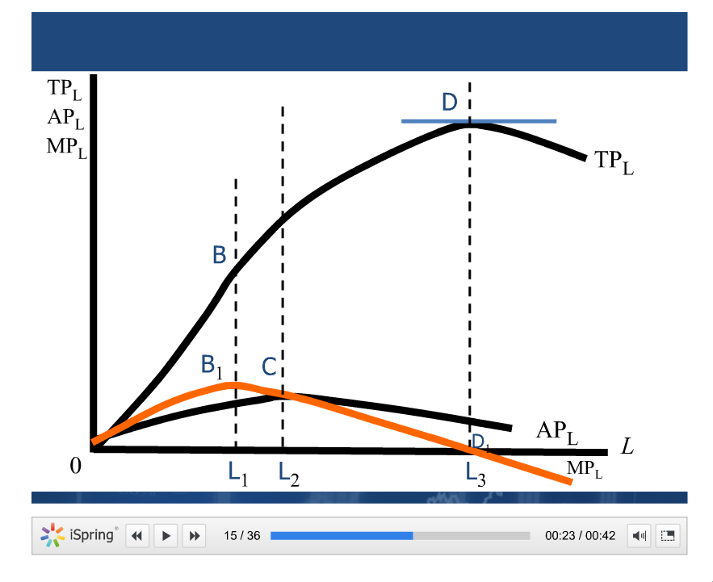
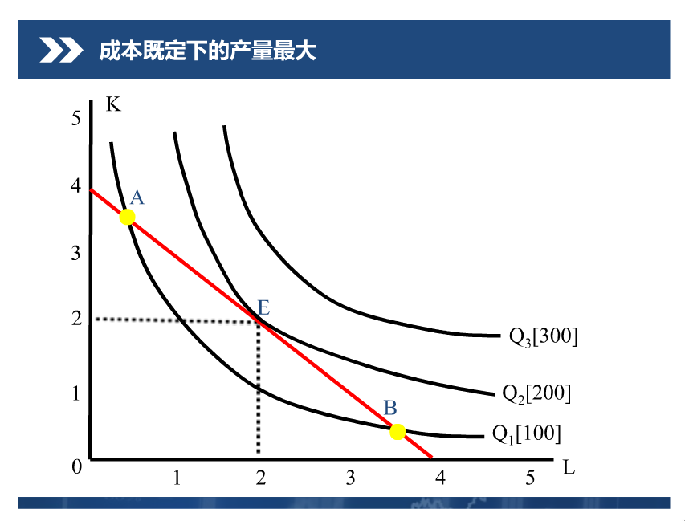

目录
----
-   [目录](#目录)
-   [第一章 引论](#第一章-引论)
    -   [重要的名词解释](#重要的名词解释)
    -   [选择题](#选择题)
    -   [判断题](#判断题)
-   [第二章 需求供给和均衡价格](#第二章-需求供给和均衡价格)
    -   [需求](#需求)
    -   [供给](#供给)
    -   [均衡价格](#均衡价格)
    -   [经济模型](#经济模型)
    -   [弹性理论](#弹性理论)
    -   [恩格尔系数](#恩格尔系数)
    -   [供求分析的应用示例](#供求分析的应用示例)
-   [第三章 效用论](#第三章-效用论)
    -   [效用论概述](#效用论概述)
    -   [无差异曲线](#无差异曲线)
-   [第四章 生产函数](#第四章-生产函数)
    -   [企业](#企业)
    -   [生产](#生产)
    -   [一种可变生产要素的生产函数](#一种可变生产要素的生产函数)
    -   [长期生产函数](#长期生产函数)

第一章 引论
-----------

### 重要的名词解释

1.  什么是动态分析？
    是分析均衡条件的改变而进行调整的过程和路径。（什么鬼？）

2.  什么是机会成本？ 在你没有做的事情中，
    你损失最大的那一件事情就是你的机会成本。

3.  什么是微观经济学？ 是研究单个厂商与家庭在市场上如何进行经济决策的
    经济理论体系。

4.  什么是比较静态分析？
    通过不同过程进行对比分析的方式来说明实现均衡的基本条件。

5.  什么是静态分析？ 就是分析达到均衡状态的条件。

6.  什么是稀缺性？ 相对于人类的无穷的欲望来说， 资源当然是稀缺的。

### 选择题

1.  经济学是研究（如何实现稀缺性资源的有效配置问题）。

2.  经济物品是指（有用而稀缺的物品）。

3.  "资源的稀缺性"是指（相对于资源的需求而言，资源总是不足的）。

4.  在市场经济中， 商品为~~（消费者）~~（买得起，且想买的人）生产。

5.  生产可能性曲线说明的基本原理是（假定所有资源能被充分有效利用，
    增加x商品的生产必须减少y商品的生产）。

6.  人们在进行决策时， 必须做出某种选择，
    这是因为（人们在决策时所面临的资源是稀缺的）。

7.  在开放区建造一个网球场的机会成本是（用于其他用途可得的最大收入）。

8.  在市场经济条件下， 决策主要由（生产者和消费者）作出。

9.  以市场经济为主要资源配置方式的经济中，
    （~~均衡~~价格）起到了关键的作用。

10. 由市场配置资源意味着（资源配置是由市场规则（机制）实现的）。

11. 经济学研究的基本问题是（生产什么， 生产多少， 怎样生产，
    为谁生产）。

12. 政府决策是对市场机制失灵的修补。

13. 微观经济学与宏观经济学的区别在于（微观经济学研究个体行为，
    而宏观经济学研究总体经济现象）。

14. 微观经济学解决的问题是~~（单个经济单位的经济行为）~~（资源配置）。

15. 一国的生产可能性曲线上的点表示（社会使用既定的生产资源所能生产的最大组合）。

16. 当经济学家说人们是理性的，
    这是指（人们总会从自己的角度做出最好的决策）。

17. 微观经济学研究的是（单个）经济单位的经济行为。

18. 在既定的资源约束下，
    社会最有效率生产的商品组合位于（生产可能性曲线上）。

19. 经济学中， 生产资源的相对有限性被称为资源的（稀缺性）。

### 判断题

1.  如果社会不存在稀缺性， 也就不会产生经济学（对）

2.  只有有人类社会， 就会存在稀缺性（对，因为人的欲望是无限的）

3.  资源的稀缺性决定了资源可以得到充分利用，
    不会出现资源浪费的现象。（错）

4.  生产什么，怎样生产，为谁生产，这三个问题被称为资源利用问题。（错，
    那个生产多少呢？）

5.  在不同的经济体制下， 资源配置和利用问题的解决方法是不同的。（对）

6.  微观经济学研解决的问题是资源利用，
    宏观经济学要解决的问题是资源配置。~~（对）~~

第二章 需求供给和均衡价格
-------------------------

### 需求

1.  什么是需求？ 是指消费者在一定时期，在可能的价格区域内，
    愿意**且能够**购买的商品的数量。

2.  需求函数的方向是向下的， 斜率小于零， 因为对于消费者来说，
    价格越高， 需求就会越少。

### 供给

1.  什么是供给？ 是指厂商在一定时期内，在可能的价格下，
    愿意且能够提供出售的该种商品的数量。

2.  需求函数的方向是向上的， 斜率大于零， 因为对于厂商来说， 价格越高，
    供给就会越多。

### 均衡价格

1.  什么是供给均衡： 供给和需求这两股力量旗鼓相当时的一种状态。

2.  当商品价格在均衡价格之上的时候是供过于求， 反之是供不应求。

3.  比均衡价格高的太多的话， 就变成黑市价格了。

### 经济模型

1.  什么是经济模型？ 就是那个函数关系嘛

### 弹性理论

1.  弹性系数 = 因变量的变动比例/自变量的变动比例

2.  薄利多销要求商品的弹性系数大于1， 是针对于需求曲线来讲的。

### 恩格尔系数

1.  恩格尔定律：随着收入的增加， 食品支出在全部支出中所占比例越来越少，
    即恩格尔系数是递减的。

2.  恩格尔系数：联合国判别生活水平的标准。

### 供求分析的应用示例

1.  什么是支持价格？
    是政府为了扶持某一行业的生产而规定的该行业产品的最低价格。

2.  什么是限制价格？
    是政府为了限制某些生活必需品的价格上涨而规定的这些产品的最高价格。

第三章 效用论
-------------

### 效用论概述

1.  什么是消费者？ 经济中， 能够做出独立的消费决策的单位，
    他可以是个人， 也可以是由若干人组成的家庭。

2.  什么是效用？ 是指消费者从消费某种物品或劳动中所获得的满足度。

3.  什么是欲望？ 欲望是一种缺乏的感觉与求得满足的愿望。

4.  如何度量满足程度？ 这里我们用基数效用论
    ，之后就慢慢发展为序数效用论了。

5.  序数效用论认为，效用作为一种心理现象，是无法计量的，
    也不能加总求和。

6.  基数效用论推出了边际效用的分析方法，
    而序数效用论推出了无差异曲线的分析方法

7.  基数效用论与序数效用论的比较

| 效用理论类型 | 主要观点 | 假设条件 | 分析方法 |  
| :------| :------ | :------ | :----- |  
| 基数效用论 | 效用可计量 | 苛刻 | 边际效用分析方法 |  
| 序数效用论 | 效用课比较 | 宽松 | 无差异曲线分析方法 |  

8.  什么叫边际效用？ 是指消费者在一定时期内，
    每增加一件某种商品的消费量所增加的满足度。

9.  什么是边际效用递减规律？ 在一定时期内，
    在其他商品的消费量保持不变的前提下，
    随着消费者对某种商品的消费量的增加，
    他从该商品连续增加的每一单位消费中所获得的效用的增量（即边际效用）是递减的。

10. 消费者均衡研究的是单个消费者如何将有限的收入分配在各种商品的够买中以获得最大的效用。

11. 需求曲线上的每一个点都是消费者效用最大化或满足程度最大化的均衡点。

### 无差异曲线

1.  什么是无差异曲线？
    用于表示两种商品的不同数量组合给消费者所带来的效用完全相同的一条曲线。

2.  无差异曲线是凸向原点的。

3.  实现同样满足程度， 增加一种商品， 必须减少另一种。

4.  同一个平面上， 有无数条无差异曲线， 不能相交。

5.  边际效用替代率： 效用水平不变，
    消费者增加一单位某种商品的消费量时所需放弃的另一种商品的消费数量。

6.  预算线：用于表示消费者收入和商品价格既定的前提下，
    消费者的全部收入所能够购买的两种商品的各种组合。

7.  在那个切点上实现了消费者均衡
    

8.  那个收入-消费曲线就是无数的切点组成的线。

第四章 生产函数
---------------

### 企业

1.  企业（生产者，厂商）是指能够做出统一生产决策的单个经济单位。

2.  企业是市场经济中生产组织的基本单位， 分为个人企业，合伙企业，
    公司制企业。

3.  企业的目标永远是实现利润最大化。

### 生产

1.  生产是对各种生产要素进行组合产生产品的行为。

2.  生产要素：劳动，资本，土地，企业家才能。

3.  短期是指生产者来不及调整全部生产要素的数量， 至少有一种生产要素
    的数量是不变的时间周期。

4. 长期是指生产者可以调整全部生产要素的时间周期。

### 一种可变生产要素的生产函数

1.  这种生产函数也叫短期生产函数。

2. 这里的主要概念有：总产量， 平均产量， 边际产量。

3. 什么是边际报酬递减规律？
  在技术水平不变的前提下， 在连续等量地把一种可变要素增加到其他一种或几种数量不变的生产要素上去的过程中，当这种要素的投入量少于某一特定值时， 增加这种要素带来的边际产量是递增的， 当这种可变要素投入量连续增加并超过这个特定值时， 增加该要素投入带来的边际产量是递减的。

4. 边际报酬递减规律是短期生产的一条基本规律。

5. 看下面这图， 最高那个是总产量， 橙色那个是边际产量， AP是平均产量

  

6. 短期生产分为三个阶段
  第一个阶段0-L2， 这个阶段平均产量一直递增  
  第二个阶段L2-L3， 这个阶段总产量还是增
  第三个阶段L3--， 这个阶段连总产量都减了

### 长期生产函数

1. 这里的的等产量函数就跟序数效用论中的无差异曲线一样。

2. 而等成本线就与上面的预算线一样。

3. 而最优生产要素组合就与消费者均衡一样。
  

第五章 成本
---------

### 经济学中的成本

1. 什么是成本？
  成本就是生产费用， 企业生产一定的产品所需要的生产要素的费用。

2. 什么是机会成本？
  生产者所放弃的使用相同生产要素在其他生产用途中所能够获得的最大收入。

3. 经济成本 = 显成本 + 隐成本

4. 利润 = 总收益 - 经济成本

### 短期成本分析

1. 什么是短期？
  短期就是厂商不能够根据它所要达到的产量来调整所有生产要素的时期。

2. 可变成本是指厂商短期可以调整的成本如燃料，员工， 原料。 而不变成本就是短期不能调整的成本， 如厂房， 设备， 管理人员的工资。

### 长期成本分析

1. LTC = LTC(Q)

第六章 完全竞争市场
----------------

### 厂商和市场类型

1. 市场类型分为四种： 完全竞争市场， 垄断竞争市场， 寡头市场， 垄断市场

### 完全竞争市场和利润最大化

1. 厂商的需求曲线：无论它的需求需求如何变动， 它的价格也不变。

1. 完全竞争厂商的总收益（TR）， 平均收益（AR）与边际收益（MR）。

2. 完全竞争市场的平均收益等于边际收益？

3. MR = SMC是厂商实现利润最大化的均衡条件。

4. SMC就是短期边际成本。

### 完全竞争市场的短期均衡和短期供给曲线

1. 完全竞争厂商的短期可生产的条件为：AR = P >= AVC

6. 短期中完全竞争厂商的供给曲线是MC在AVC之上的部分

### 完全竞争行业的短期供给曲线

1. 短期市场供给曲线是单个厂商的供给曲线在横向加总。

### 完全竞争市场的长期均衡

### 完全竞争行业的长期供给曲线

第六章 生产要素价格决定
-------------------

### 
