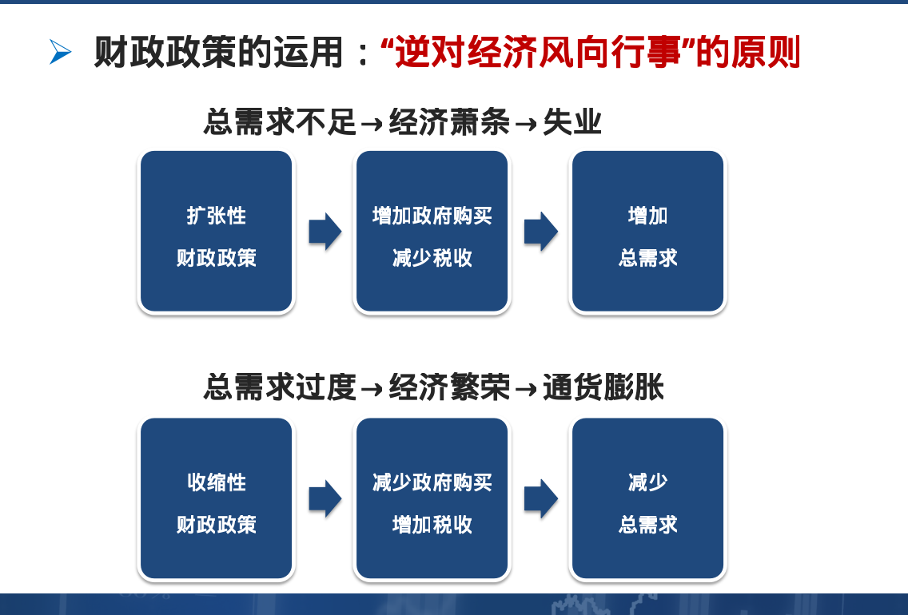

# 第十二章 宏观经济政策
- 宏观经济政策目标(六大目标)
> - 充分就业-相当于自然失业率的失业率
> - 物价稳定-低且可预期的通货膨胀率
> - 经济增长-国民经济持续而稳定的增长
> - 减轻经济波动
> - 经济持续均衡增长
> - 国际收支平衡-既无国际收支盈余也无国际收支赤字
- 财政政策：为促进就业水平提高，减轻经济波动，防止通货膨胀，实现稳定增长而对政府支出、税收和借债水平所进行的选择，或对政府收入和支出水平所作的决策。
- 财政政策的工具
> - 政府支出,包括政府购买和政府转移支付
> - 政府收入,主要是税收
> - 财政政策的机制——运用政府支出和税收来调节总需求以达到实现充分就业或物价稳定的宏观经济政策目标。
> - 
- 内在稳定器:指某些财政政策具有自动调节经济使经济趋于稳定的机制
> - 经济萧条→所得税减少、转移支付增加→自动抑制总需求的下降。
> - 经济繁荣→所得税增加、转移支付减少→自动抑制总需求的上升。
- 货币政策：中央银行通过控制货币供应量以及通过货币供应量来调节利率进而影响投资和整个经济以达到一定经济目标的行为就是货币政策。
- 公开市场业务：中央银行在金融市场上公开买卖政府债券以控制货币供给和利率的政策行为。
