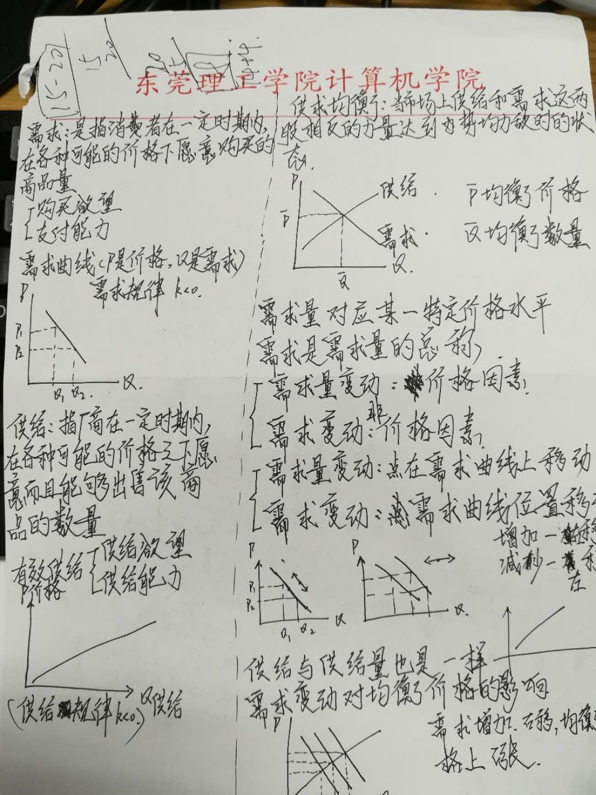
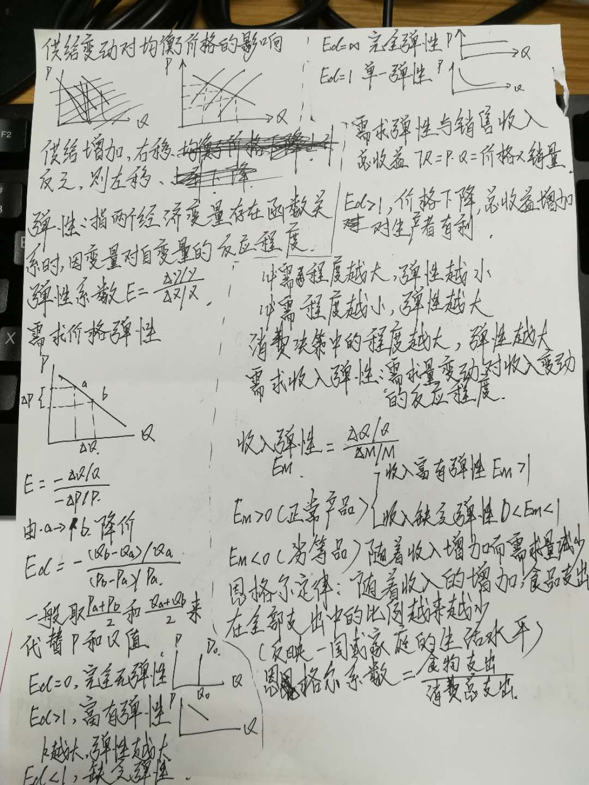
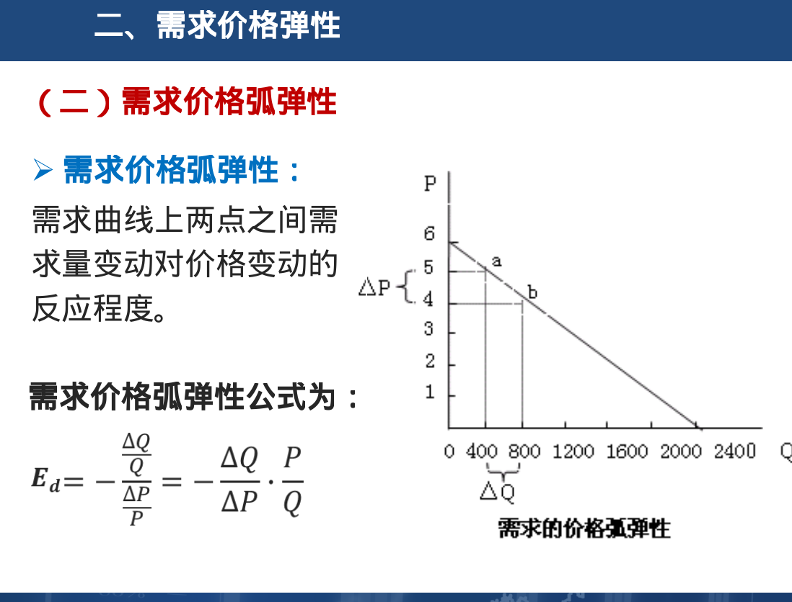
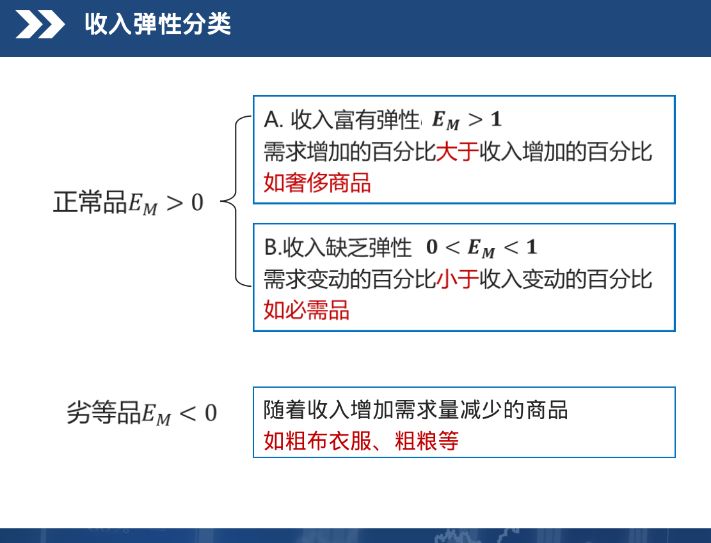

# 第二章 需求,供给和均衡价格

- 由于之前已经手写过笔记,重复内容就不再敲一遍了...
- 手写笔记,排版混乱请忽略...
> - 
> - 
> - 

#### 补充
- 均衡:指经济事务中的有关变量在一定条件下相互作用所达到的一种相对静止的状态
- 供求均衡:当市场上供给和需求这两股相反的理论达到势均力敌时的一种状态
- 需求价格弹性:简称需求弹性,指一定时期内一种商品需求量变动对于该商品价格变动的反应程度
> - 
- 收入弹性：需求量变动对收入变动的反应程度
> - 
- 需求交叉弹性：当另一种商品价格变动1％，某种商品需求量会相应变动的百分比
> - 互补商品之间价格与需求成反向变动；
> - 替代商品之间价格与需求成正向变动。
- 支持价格:是政府为了扶持某一行业的生产而规定的该行业产品的最低价格。
- 限制价格:是政府为了限制某些生活必需品的价格上涨而规定的这些产品的最高价格。
