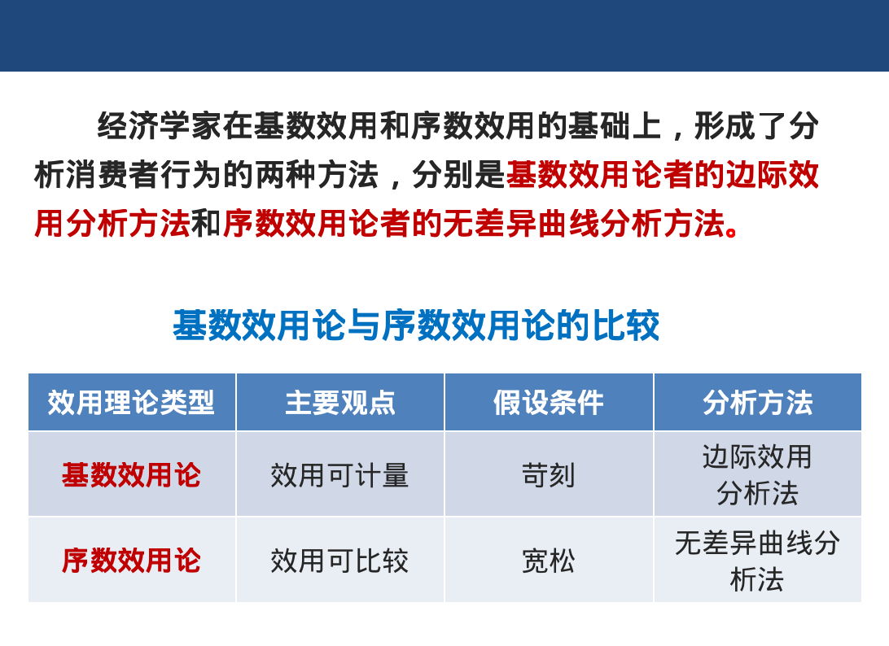
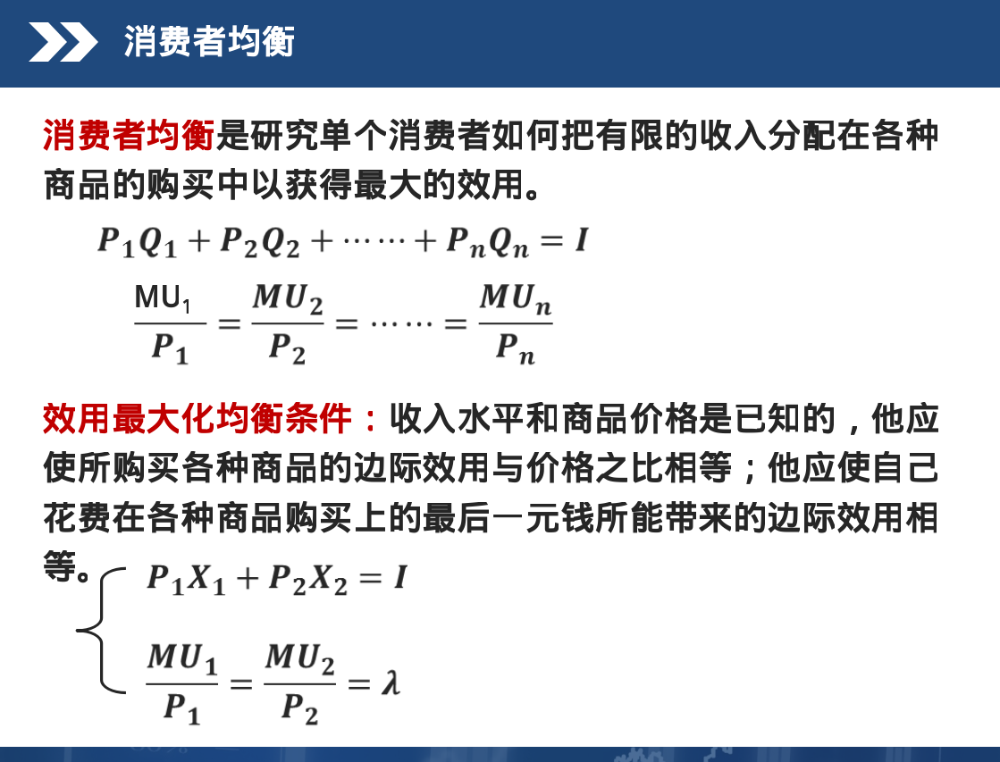
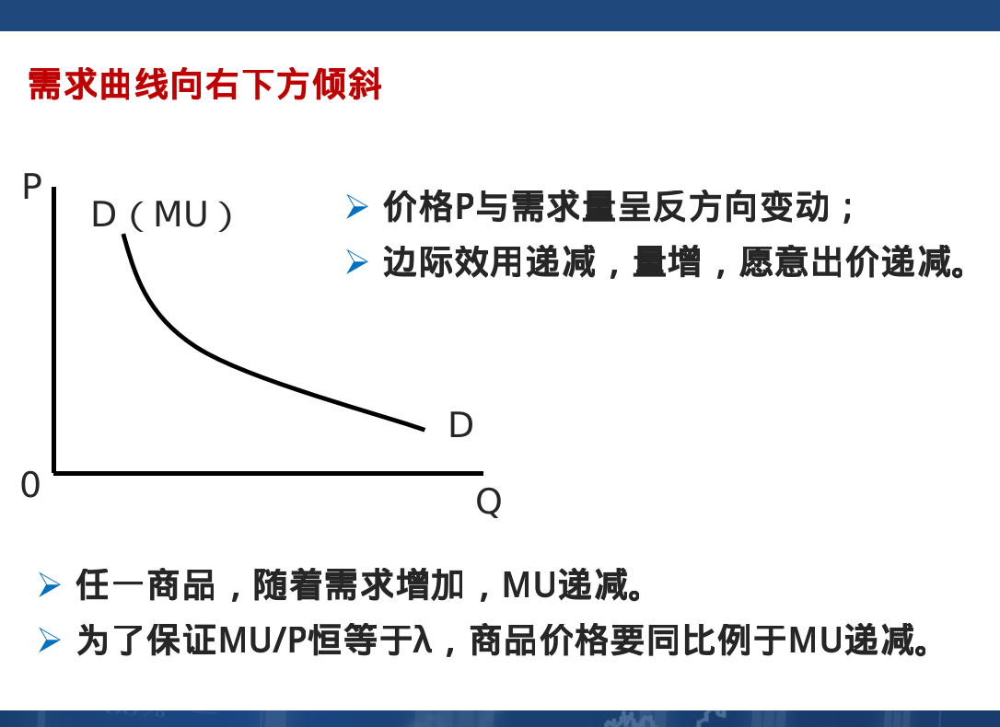
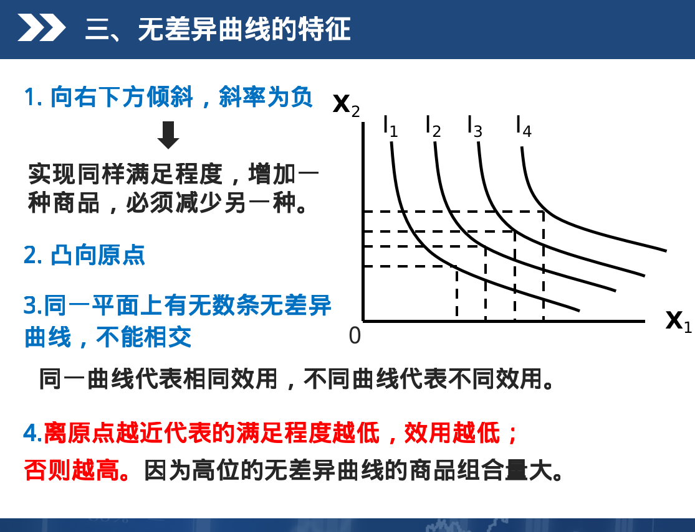
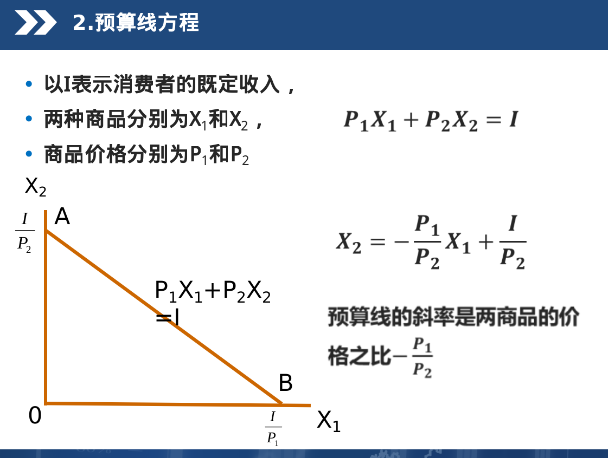
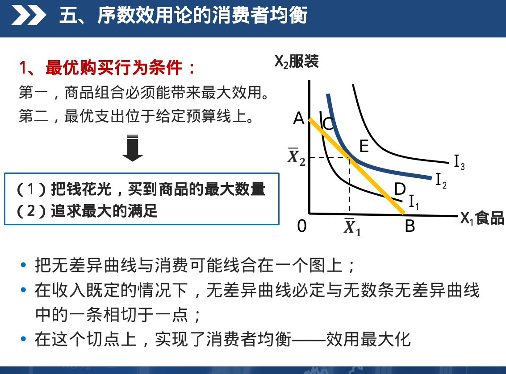
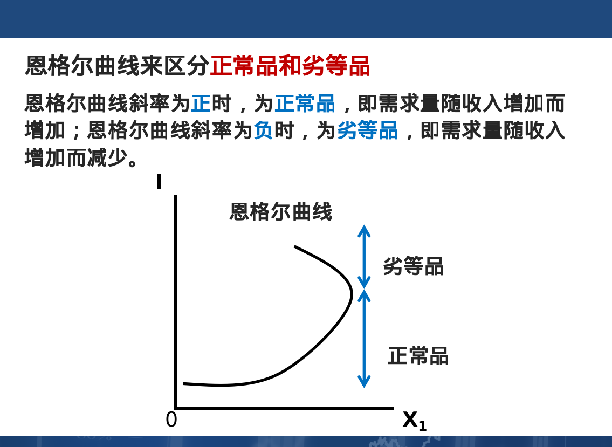

# 消费者行为理论

- 重复内容不重新敲
> - 
- 基数效用论和序数效用论
> - 
- 边际效用递减规律:在一定时间内，在其他商品消费量保持不变的条件下，随着消费者对某种商品消费量的增加，他从该商品连续增加的每一单位消费中所得到的效用增量即边际效用是递减的。
- 消费者均衡:研究单个消费者如何把有限的收入分配到各种商品的购买中以获得最大的效用
> - 下图为基数效用论的消费者均衡
> - 
- 需求曲线上的每一点都是消费者效用最大化或满足程度最大化的均衡点。
> - 解释如下图
> - 
- 无差异曲线:用于表示两种商品的不同数量的组合给消费者所带来的效用完全相同的一条曲线。
> - 
> - 无差异曲线里面,有着商品边际替代率的体现
> - 商品的边际替代率:效用水平不变,消费者增加一单位某种商品的消费量时所需要放弃另一种商品的消费数量
> - 无差异曲线上某点的边际替代率=该点斜率的绝对值
- 预算线:用于表示在消费者收入和商品价格既定的前提下，消费者的全部收入所能购买到的两种商品的各种组合。
> - 
- 序数效用论的消费者均衡
> - 
- 使用恩格尔曲线来区分正常品和劣等品
> - 
- 商品价格变化引起对其需求量的变化,可分两种情况
> - 收入效应:收入效应指由商品的价格变动所引起的实际收入水平变动，进而由实际收入水平变动所引起的商品需求量的变动。(简单举个例子,价格减低,一单元的货币对其购买力增强,需求量上升)
> - 替代效应:价格变动引起相对价格的变动,从而引起需求量变动
> - - 不改变消费者的效用水平
