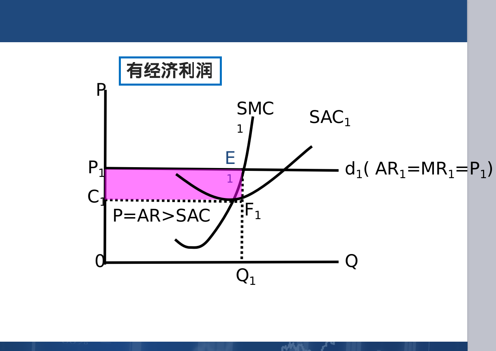

# 第五章
#### 常用单词
- P:价格
- Q:需求
- R:Revenue 收益

#### 完全竞争市场
- 市场:完全竞争市场,垄断竞争市场,寡头市场,垄断市场
> - 
- 行业:是指为同一个商品市场生产和提供商品的所有厂商的总体
- 完全竞争:纯粹竞争,是一种竞争不受任何阻碍和干扰的市场结构
> - 市场上有大量的买家和卖家
> - 商品都是同质的
> - 资源具有完全的流动性
> - 信息是完全的
> - 
> - 
> - 
- 厂商实现利润最大化的均衡条件
> - 厂商按照MR=SMC的利润最大化原则来决定其产量
> - 
- 有几个图是需要了解一下的
> - 完全竞争厂商的短期可生产的条件为：AR=P≥AVC
> - 注意区分正常利润和经济利润的区别
> - 
> - 
> - 
> - 最优产量点Q,在这一产量点上，MR=P=SMC，企业会有最优利润或最小亏损
> - 行业是否有经济利润或亏损是企业作出进入或退出决策的信号。
> - 最优产量点的组合都在SMC曲线上,所以有如下结论:
> - - 完全竞争厂商的短期供给曲线恰好是其SMC等于和高于AVC曲线最低点的部分。
- 短期行业供给曲线:短期市场供给曲线表示每一个可能的价格下整个行业在短期中生产的产量,它等于所有私人厂商供给数量的总和
- 短期市场供给曲线
> - 
- 完全竞争厂商在长期内对全部生产要素的调整表现为两个方面:
> - 调整生产规模
> - 进入或退出一个行业
- 附上PPT的几道计算题
> - 长期均衡:以不变价格提供产量，该价格等于厂商的LAC(或 LTC)的最低点(以成本价去出售)。没有经济利润,单个厂商利润为零
> - 
> - 
> - 
> - 

#### 完全垄断市场
- 完全垄断:整个行业的市场完全处于一家厂商所控制的状态
> - 一家厂商控制了某种商品的全部资源或资本资源的供给,是价格的制定者
> - 独家厂商所用于生产某种商品的专利权
> - 政府特许,其它厂商不能进入该产品市场
> - 自然垄断,规模经济派生自然垄断
