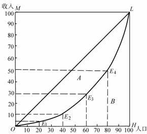
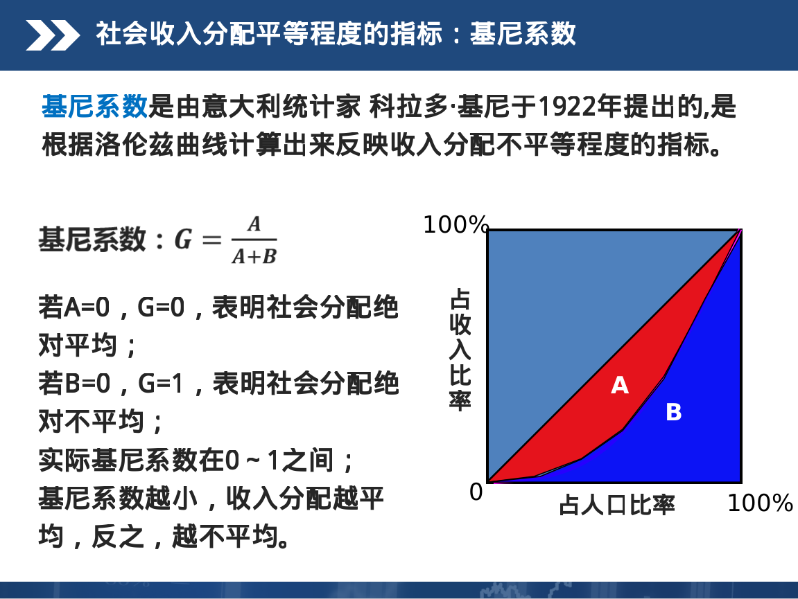
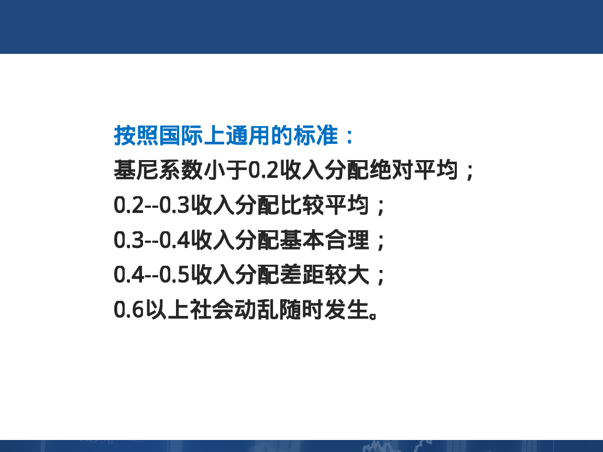

# 第六章 生产要素价格决定
#### 常用单词
- L:劳动
- K:资本
- w:劳动的价格
- r:资本的价格

#### 知识点整理
- 分配问题:生产出来的产品分配给谁
- 解决分配问题就是解决生产要素的价格决定问题
- 完全竞争要素市场的特征
> - 有大量的生产要素的出售者和购买者
> - 生产要素是同质的,没有任何差别
> - 生产要素的买方和卖方都是价格的接受者
> - 要素供求双方都有完全的信息
> - 要素自由流动
- 对于厂商而言,雇佣多少劳动是合理的
> - 边际相等原则:增加一单位劳动所产出的边际收益与劳动的边际成本相等

- 洛伦兹曲线(收入分配平等程度的标准)
> - 用来衡量社会收入或财产分配平均程度的曲线
> - 画一个矩形，矩形的高衡量社会财富的百分比，将之分为五等份，每一等分为20的社会总财富。在矩形的长上，将100的家庭从最贫者到最富者自左向右排列，也分为5等分，第一个等份代表收入最低的20的家庭。在这个矩形中，将每一百分的家庭所有拥有的财富的百分比累计起来，并将相应的点画在图中，便得到了一条曲线就是洛伦兹曲线。
> - 
- 基尼系数(社会收入分配平等程度的指标)
> - 
> - 
