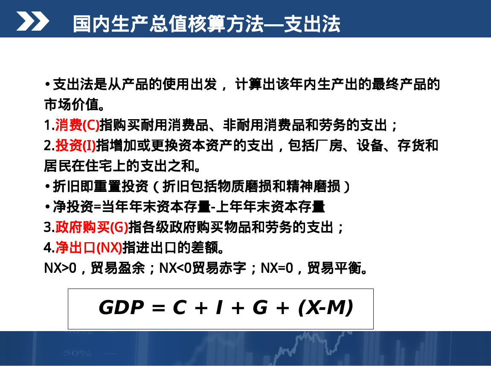

# 第七章 国民收入核算理论
- 国内生产总之(GDP):指在一定时期内,在一国(或地区)境内生产的所有最终产品和服务的市场价值总和
- GDP测度的是最终产品的价值，中间产品价值不计入GDP，以避免重复计算
- 最终产品：在一定时期内生产的并由其最后使用者购买的产品和劳务就称为最终产品。
- 中间产品是指用于再出售而供生产别种产品用的产品
- 国民生产总值GNP = GDP + 本国公民在外国得到的收入 - 外国公民在本国得到的收入
- GDP仅指市场活动导致的价值，没经过市场销售的最终产品（如家务
劳动，自给自足生产等）没有价格，也就无法计入GDP中
- 国内生产总值核算方法(支出法)
> - 
