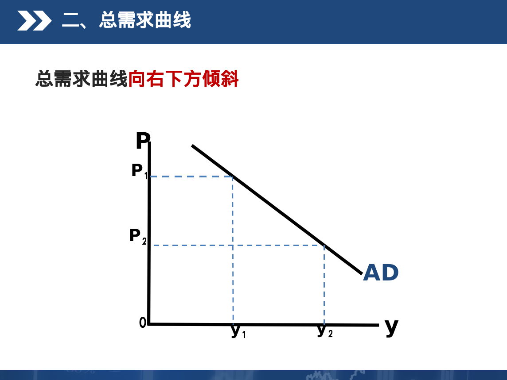
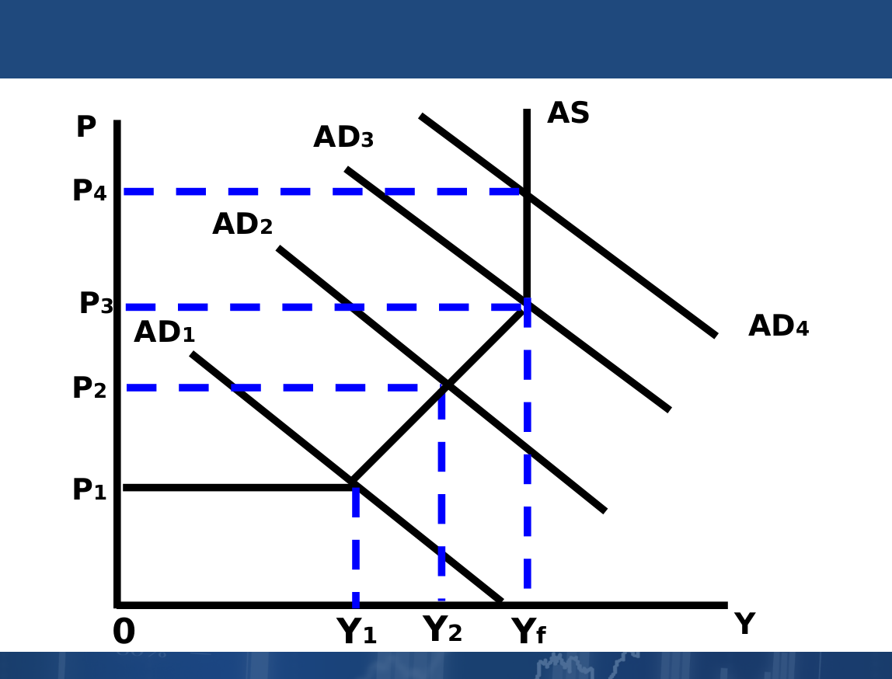
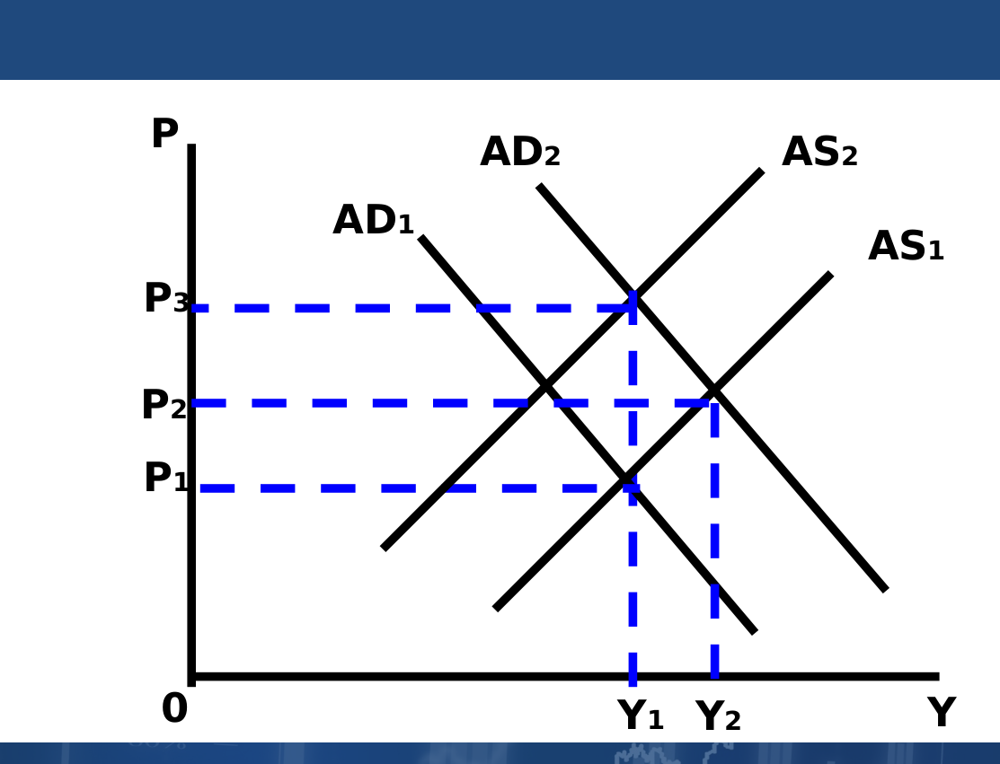
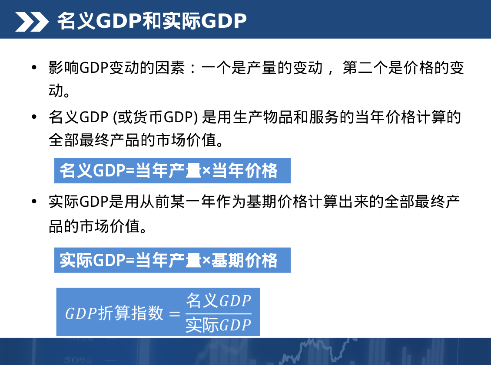
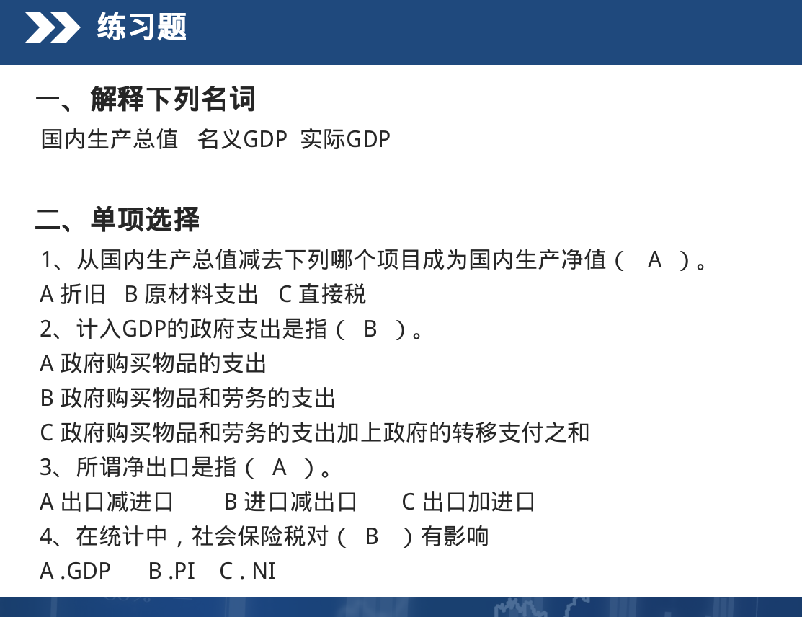
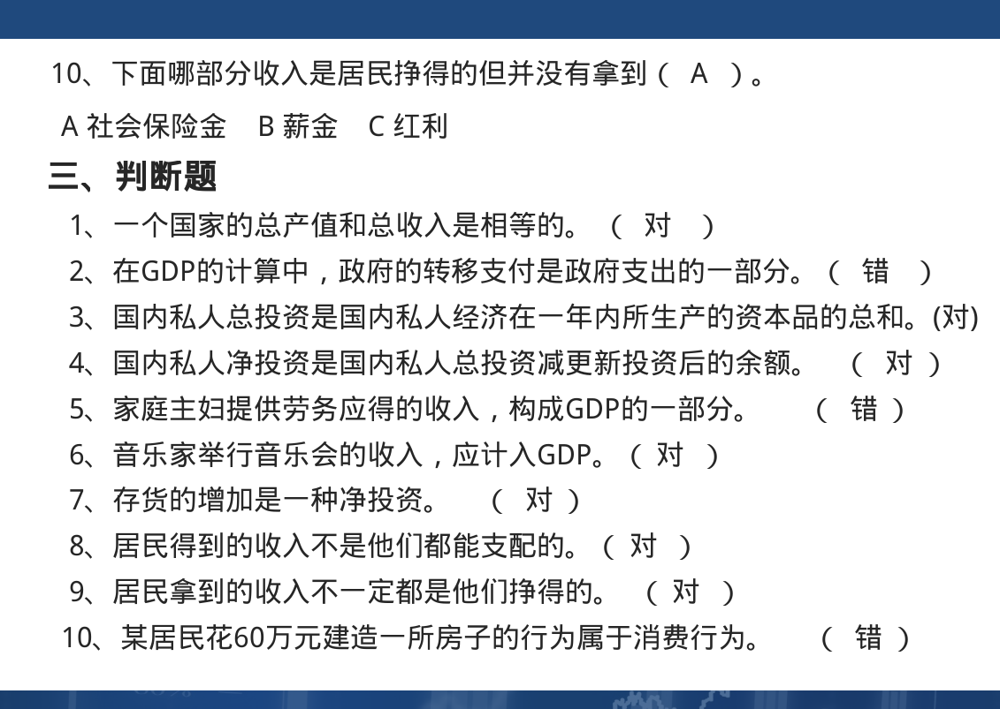
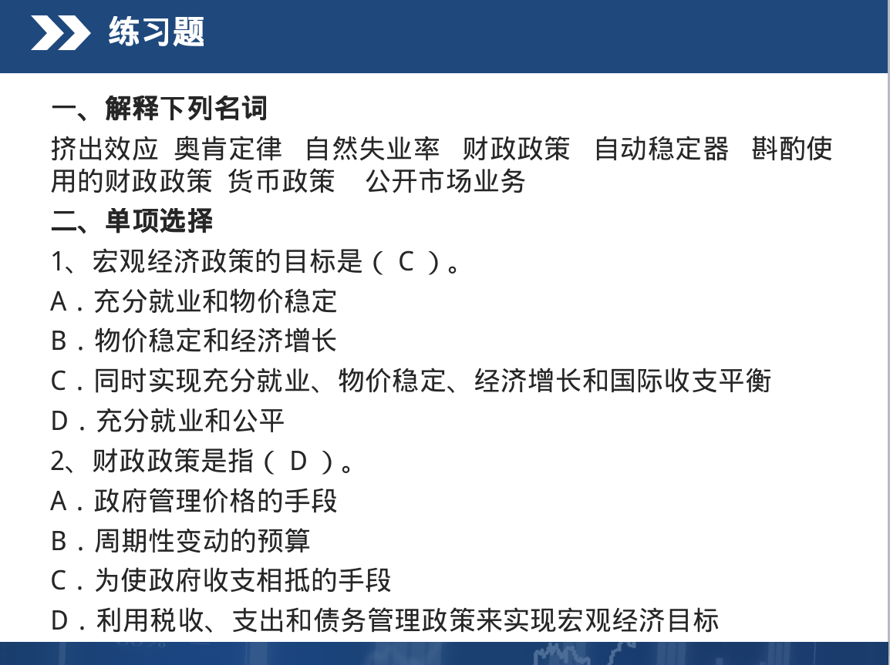
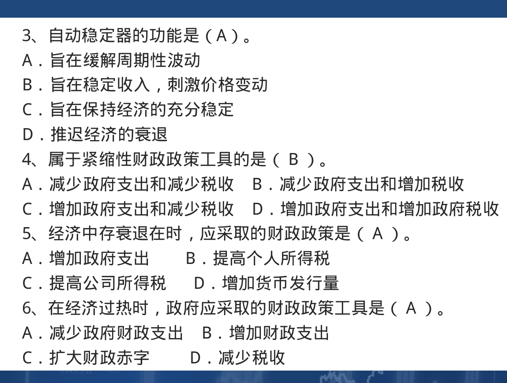
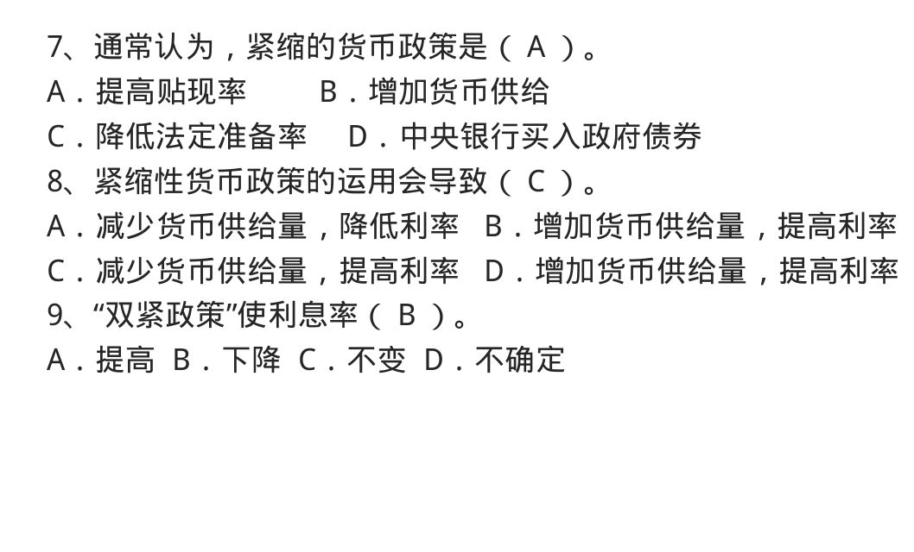
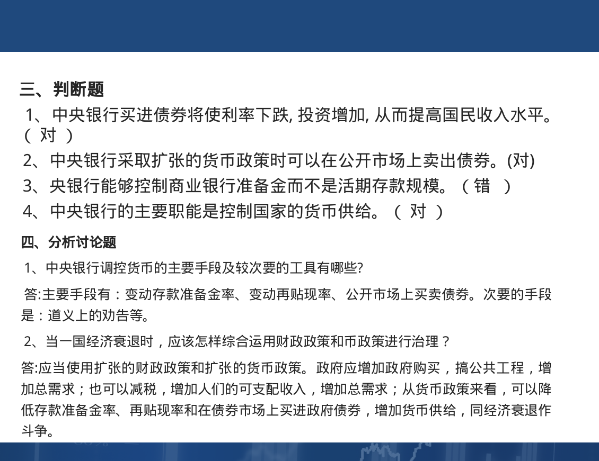

# 国民收入决定理论
- S:supply 供给
- A:ALL 合计
- D:需求

#### AD与AS
- 总需求:整个社会对产品和劳务需求的综合
> - 总需求 = 消费 + 投资 + 政府够买 + 净出口
> - AD = C + I + G + (X - M)
> - 消费支出在总支出中所占的比重最大
> - 
- 总供给:整个社会提供的商品与劳务的价值总和
- 总供给曲线AS:表示产品和货币市场同时均衡时社会总供给量与价格总水平之间的关系

#### 失业与通货膨胀理论
- 周期性事业:由于总需求不足而引起的短期事业,一般出现在经济周期的萧条阶段,故称为周期性失业
- 自然失业率： 在没有货币因素干扰的情况下，让劳动市场和商品市场自发供求力量发生作用时，总需求和总供给处于均衡状态的失业率
- 紧缺性缺口:实际总需求<充分就业总需求,导致周期性失业
- 奥肯定理:失业率每增加1%，实际国民收入减少2.5%
- 通货膨胀:通货膨胀是指物价水平普遍而持续的上升(总需求大于总供给)
- 物价指数:衡量通货膨胀的指标
- 通货膨胀厂商的原因
> - 需求拉动的通货膨胀
> - - 
> - 成本推动的通货膨胀(由于生产成本的增加所导致的总供给的减少)
> - - 
> - 供求混合推动的通货膨胀理论(物价和工资螺旋式上升)
> - - 
- 引起总需求过度从而导致通
货膨胀产生的根本原因在于货币的过量发行

#### PPT内的习题

