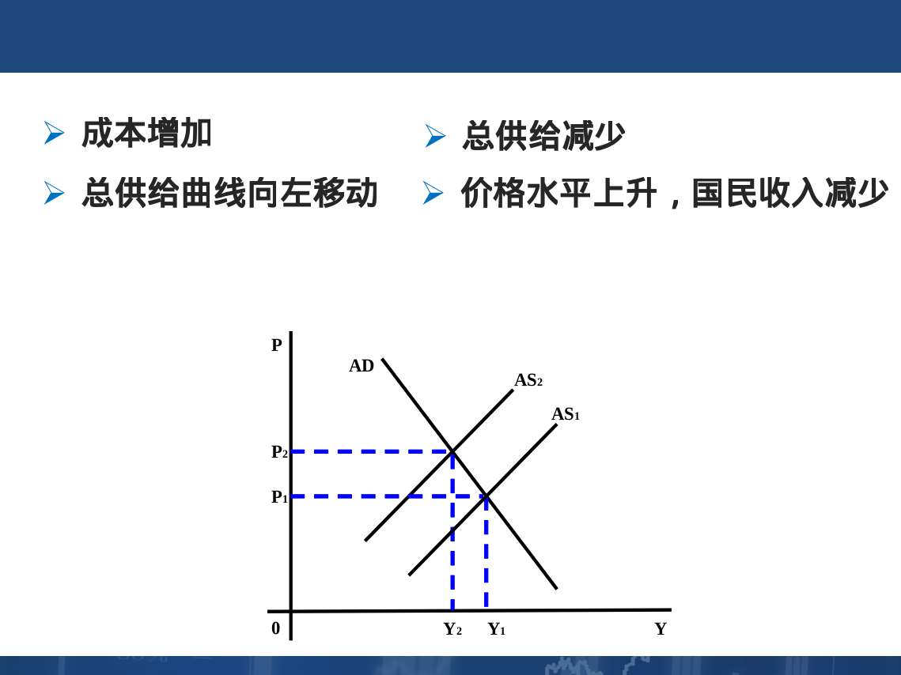
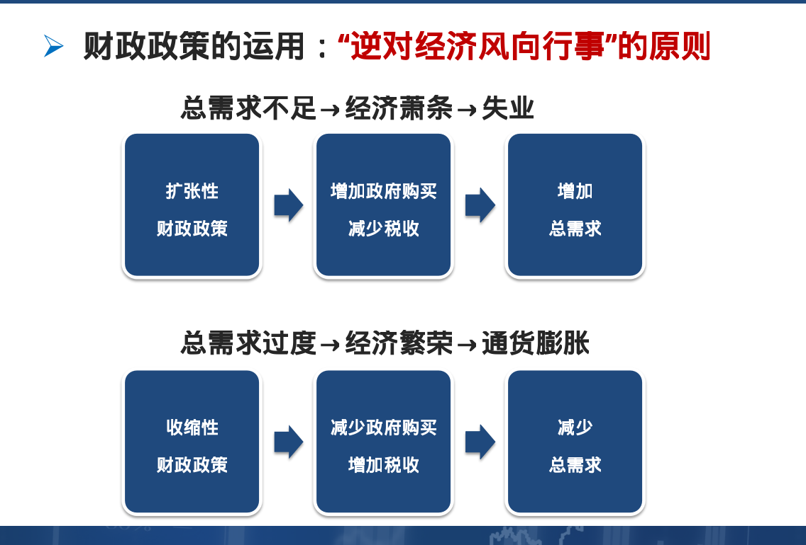

# 国民收入决定理论
- S:supply 供给
- A:ALL 合计
- D:需求

#### AD与AS
- 总需求:整个社会对产品和劳务需求的综合
> - 总需求 = 消费 + 投资 + 政府够买 + 净出口
> - AD = C + I + G + (X - M)
> - 消费支出在总支出中所占的比重最大
> - 
- 总供给:整个社会提供的商品与劳务的价值总和
- 总供给曲线AS:表示产品和货币市场同时均衡时社会总供给量与价格总水平之间的关系

#### 失业与通货膨胀理论
- 周期性事业:由于总需求不足而引起的短期事业,一般出现在经济周期的萧条阶段,故称为周期性失业
- 自然失业率： 在没有货币因素干扰的情况下，让劳动市场和商品市场自发供求力量发生作用时，总需求和总供给处于均衡状态的失业率
- 紧缺性缺口:实际总需求<充分就业总需求,导致周期性失业
- 奥肯定理:失业率每增加1%，实际国民收入减少2.5%
- 通货膨胀:通货膨胀是指物价水平普遍而持续的上升(总需求大于总供给)
- 物价指数:衡量通货膨胀的指标
- 通货膨胀厂商的原因
> - 需求拉动的通货膨胀
> - - 
> - 成本推动的通货膨胀(由于生产成本的增加所导致的总供给的减少)
> - - 
> - 供求混合推动的通货膨胀理论(物价和工资螺旋式上升)
> - - 
- 引起总需求过度从而导致通
货膨胀产生的根本原因在于货币的过量发行

#### 宏观经济政策
- 宏观经济政策目标
> - 充分就业-相当于自然失业率的失业率
> - 物价稳定-低且可预期的通货膨胀率
> - 经济增长-国民经济持续而稳定的增长
> - 国际收支平衡-既无国际收支盈余也无国际收支赤字
- 财政政策：为促进就业水平提高，减轻经济波动，防止通货膨胀，实现稳定增长而对政府支出、税收和借债水平所进行的选择，或对政府收入和支出水平所作的决策。
- 财政政策的工具
> - 政府支出,包括政府购买和政府转移支付
> - 政府收入,主要是税收
> - 财政政策的机制——运用政府支出和税收来调节总需求以达到实现充分就业或物价稳定的宏观经济政策目标。
> - 
- 内在稳定器:指某些财政政策具有自动调节经济使经济趋于稳定的机制
> - 经济萧条→所得税减少、转移支付增加→自动抑制总需求的下降。
> - 经济繁荣→所得税增加、转移支付减少→自动抑制总需求的上升。
- 货币政策：中央银行通过控制货币供应量以及通过货币供应量来调节利率进而影响投资和整个经济以达到一定经济目标的行为就是货币政策。
- 公开市场业务：中央银行在金融市场上公开买卖政府债券以控制货币供给和利率的政策行为。

#### PPT内的习题

